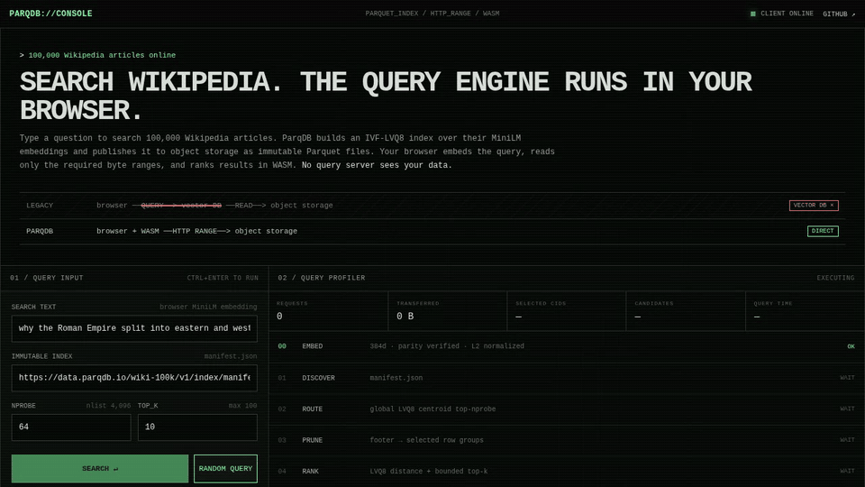

<div align="center">
  <picture>
    <source media="(prefers-color-scheme: dark)" srcset="https://raw.githubusercontent.com/parqdb-io/parqdb/main/assets/parqdb/logo-dark.svg">
    
  </picture>
  <p>
    <a href="https://github.com/parqdb-io/parqdb/blob/main/README.md">English</a> |
    中文
  </p>
  <p>
    <strong>完全基于 Parquet 和 Arrow 构建的十亿级嵌入式向量数据库。</strong>
  </p>
  <p>
    <a href="https://pypi.org/project/parqdb/"></a>
    <a href="https://github.com/parqdb-io/parqdb/actions/workflows/ci.yml"></a>
    <a href="https://github.com/parqdb-io/parqdb/blob/main/pyproject.toml"></a>
    <a href="https://github.com/parqdb-io/parqdb/blob/main/Cargo.toml"></a>
    <a href="https://github.com/parqdb-io/parqdb/blob/main/LICENSE"></a>
  </p>
  <p>
    <a href="https://search.parqdb.io/">浏览器演示</a> |
    <a href="#快速开始">快速开始</a> |
    <a href="#当前状态">当前状态</a> |
    <a href="#文档">文档</a>
  </p>
</div>

---

ParqDB 是一个嵌入式向量数据库，用于在内存容量有限的环境中搜索和分析
十亿级多模态数据；存储层采用 Parquet，计算层采用 Arrow 原生执行。

<p align="center">
  <a href="https://search.parqdb.io/">
    
  </a>
  <br>
  <a href="https://search.parqdb.io/"><strong>在线体验浏览器演示 →</strong></a>
  <br>
  <sub>IVF-LVQ8 · HTTP Range · Parquet · WebAssembly · 无查询服务端</sub>
</p>

**核心特性**

- **有限内存下的十亿级检索。** 仅使用 2 个 CPU 核心和 4 GB 内存，即可在
  [10 亿向量（SIFT1B）](benchmarks/results/linux-x86_64-2026-08-17/README.md)上以
  90.3% 召回率实现 63.05 ms 中位延迟。
- **一切皆 Parquet。** 源数据和向量索引均使用标准 Parquet，而非专有二进制
  格式，因此索引可以轻松地跨引擎和应用进行版本管理、发布与共享。
- **一次发布，到处查询。** 将不可变 IVF-LVQ 索引发布到对象存储，浏览器通过
  HTTP Range 和 WebAssembly 直接检索，无需查询服务端。
- **多模态数据，SQL 原生检索。** 向量检索以关系运算表达，SQL 优化器可以在
  同一执行计划中将其与过滤、Join 和聚合组合。
- **同时面向在线服务与分析。** 单查询内并行降低分析查询和大 K 检索延迟，
  查询间并行提升在线服务吞吐。
- **从单核扩展到数千核。** 既可嵌入单机运行，也可通过 Spark 或 StarRocks
  在集群规模上使用同一份 Parquet 索引。

## 快速开始

安装 ParqDB：

```bash
python -m pip install parqdb
```

下面的示例使用包内置数据集构建不复制源向量的 IVF 索引，并执行带标量
过滤的向量检索：

```python
import parqdb

session = parqdb.connect("./parqdb-data")
session.register_parquet("documents", parqdb.datasets.uri("documents"))
documents = session.table("documents")

documents.create_index(
    "documents_embedding",
    column="embedding",
    key=["document_id"],
    config=parqdb.IVF(nlist=3),
)
documents.wait_for_index("documents_embedding")

query = (
    documents.search([0.2, 0.0], column="embedding")
    .where("tenant_id = 42 AND status = 'published'")
    .nprobes(3)
    .limit(3)
    .select(["document_id", "title", "category"])
)

print(session.collect(query).to_pylist())
```

在 ParqDB 中，向量检索本身是关系查询的一部分。将它编译为 SQL 子查询后，
可以继续参与 Join 和聚合：

```python
session.register_parquet(
    "document_stats",
    parqdb.datasets.uri("document_stats"),
)
search_sql = session.to_sql(query)
summary = session.sql(f"""
    SELECT
        h.category,
        COUNT(*) AS matches,
        AVG(h._distance) AS avg_distance,
        MAX(s.popularity) AS max_popularity
    FROM ({search_sql}) AS h
    JOIN document_stats AS s USING (document_id)
    GROUP BY h.category
    ORDER BY h.category
""")
print(summary.to_pydict())
```

上述示例无需额外下载数据。持久化表、已有索引、执行计划检查和源表 Schema
要求参见[入门指南](https://github.com/parqdb-io/parqdb/blob/main/docs/getting-started.md)。

## 当前状态

| 运行时 | 存储 | 当前能力 | 状态 |
| --- | --- | --- | --- |
| 内嵌 DataFusion | Parquet | 构建和查询 IVF、IVF-LVQ4 与 IVF-LVQ8 索引 | 已支持 |
| 浏览器/WASM | 公共 HTTPS 对象存储 | 通过 HTTP Range 查询不可变 IVF-LVQ4 与 IVF-LVQ8 索引 | 实验性 |
| 内嵌 DataFusion | Iceberg | 通过 PyIceberg 查询精确表快照 | 实验性 |
| 客户端/服务端 | 已授权的 Parquet 数据源 | 通过 HTTP API 构建和查询索引 | 实验性 |

首个正式支持的产品形态是内嵌 DataFusion 运行时。索引规范仍独立于该运行
时；Python 包不再内置分布式计算引擎适配器。

安装和配置参见[本地 DataFusion 指南](https://github.com/parqdb-io/parqdb/blob/main/docs/guides/local.md)。
实验性的 HTTP 服务端部署参见
[Server guide](https://github.com/parqdb-io/parqdb/blob/main/docs/guides/server.md)。

## 文档

- [入门指南](https://github.com/parqdb-io/parqdb/blob/main/docs/getting-started.md)
  和 [Python 示例](https://github.com/parqdb-io/parqdb/tree/main/examples/python)
- [核心概念](https://github.com/parqdb-io/parqdb/blob/main/docs/concepts.md)、
  [系统架构](https://github.com/parqdb-io/parqdb/blob/main/docs/architecture.md)和
  [开放索引规范](https://github.com/parqdb-io/parqdb/blob/main/spec/README.md)
- [Python API](https://github.com/parqdb-io/parqdb/blob/main/docs/python-api.md)
  和[配置说明](https://github.com/parqdb-io/parqdb/blob/main/docs/configuration.md)，包括
  [Server guide](https://github.com/parqdb-io/parqdb/blob/main/docs/guides/server.md)
- [当前限制](https://github.com/parqdb-io/parqdb/blob/main/docs/limitations.md)、
  [故障排查](https://github.com/parqdb-io/parqdb/blob/main/docs/troubleshooting.md)和
  [路线图](https://github.com/parqdb-io/parqdb/blob/main/docs/roadmap.md)

## TEngineDB-V 与 ParqDB

[TEngineDB-V: An OLAP-Native Vector Search System for Large-k Workloads at
Tencent](https://arxiv.org/abs/2608.00650) 是腾讯用于大 K 向量检索的生产系统。
它将查询优化和执行算子深度集成到 TEngineDB 中，在百亿向量部署上相比旧
系统最高加速 52 倍。

<p align="center">
  
</p>

<p align="center">
  
</p>

ParqDB 与 TEngineDB-V 的设计思路相通，但代码和运行时完全独立。ParqDB 以
开放索引格式适配现有 SQL 引擎，目标是在不绑定专有引擎的前提下实现
TEngineDB-V 级别的大 K 检索性能。

如果你在研究中使用 ParqDB，请引用我们的 VLDB 2026 Industry Track 论文：

```bibtex
@misc{wu2026tenginedbvolapnativevectorsearch,
  title         = {{TEngineDB-V}: An {OLAP}-Native Vector Search System for Large-$k$ Workloads at Tencent},
  author        = {Xufei Wu and Pengcheng Zhang and Yitong Song and Xiaobo Zhang and Anqi Liang and Kai Wang and Jijun Du and Yidi Xiong and Guangxu Cheng and Zhe Chen and Peng Chen and Guoliang Li and Xuanhe Zhou and Fan Wu},
  year          = {2026},
  eprint        = {2608.00650},
  archivePrefix = {arXiv},
  primaryClass  = {cs.DB},
  url           = {https://arxiv.org/abs/2608.00650},
}
```

## 参与开发

ParqDB 下一阶段的方向正在公开讨论。我们欢迎真实使用场景、基准测试
结果、设计反馈和代码贡献：

- [围绕嵌入式向量湖仓收窄产品定位](https://github.com/parqdb-io/parqdb/issues/9)
- [改进基于存储的 Parquet 检索](https://github.com/parqdb-io/parqdb/issues/8)并
  [评估在线服务能力边界](https://github.com/parqdb-io/parqdb/issues/11)
- [增加可扩展的索引类型框架](https://github.com/parqdb-io/parqdb/issues/10)
- [设计存算分离架构](https://github.com/parqdb-io/parqdb/issues/13)并
  [构建完整的 DuckLake 工作流](https://github.com/parqdb-io/parqdb/issues/12)

如果你正在研究 RAG、Agent 轨迹存储、Parquet 性能或嵌入式湖仓，欢迎在
相关 Issue 中说明工作负载和需求。开始较大改动前请先留言，以便提前确认
范围和接口。

本地开发使用 uv、Maturin、Cargo 和 Makefile：

```bash
make sync
make develop
make check
```

质量门禁、测试数据、基准测试和贡献流程参见
[CONTRIBUTING.md](https://github.com/parqdb-io/parqdb/blob/main/CONTRIBUTING.md)。

## 许可证

ParqDB 的原创代码采用
[MIT License](https://github.com/parqdb-io/parqdb/blob/main/LICENSE)。发行包还
包含采用 Apache-2.0 许可证的第三方组件，详见
[第三方声明](https://github.com/parqdb-io/parqdb/blob/main/THIRD_PARTY_NOTICES.md)。

ParqDB 的开发受益于 LanceDB、DataFusion、DuckDB、StarRocks、Apache
Spark 和 Apache Iceberg 等项目，感谢这些项目的贡献者与社区。
