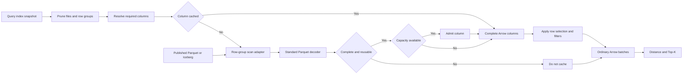

# Bounded Index Data Cache

## Problem

Relify currently has two index scan paths:

- `cache_index()` materializes the complete index and scans it through a
  memory-only implementation;
- an uncached query scans and decodes Parquet through DataFusion.

The first path is fast only when the complete index fits in memory. It has no
capacity or eviction policy, duplicates data during snapshot refresh, and
implements scan semantics separately from the storage-backed path.

Relify needs one storage-backed scan path with a bounded read-through cache.
Published Parquet or Iceberg data remains authoritative. Hot decoded data may
stay in memory, but correctness and query results must not depend on residency.

## Decisions

The first implementation makes six decisions:

| Question | Decision |
| --- | --- |
| What is cached? | Complete, unfiltered Arrow columns produced by the standard Parquet decoder. |
| What is the cache granularity? | One top-level column from one physical Parquet row group. |
| Where is the cache integrated? | In a cache-aware row-group scan adapter around DataFusion's Parquet decoder. Lookup happens before decode; admission happens at complete decoder output. |
| How is pruning preserved? | File, row-group, and column pruning happen before lookup. Partial decoder output is never admitted. |
| How are correctness and concurrency handled? | Exact immutable object identity, per-key single-flight loading, atomic admission, and reference-counted values. |
| How is memory controlled? | A session-owned byte budget, retained-buffer accounting, oversized-entry bypass, and byte-weighted LRU eviction. |

These choices are coupled. Caching a page would require integration below the
decoder and would still pay value-decoding and Arrow-allocation costs. Caching
an entire row group would waste memory across different projections. A decoded
row-group column avoids both problems while remaining reusable by ordinary
DataFusion operators.

## Scope

The first implementation covers index relations in the local DataFusion
backend. It does not cache source tables, query results, or arbitrary
DataFusion plans.

It also does not add:

- a persistent cache across process restarts;
- a cache shared by multiple processes;
- a raw byte-range or local-disk cache;
- a replacement Parquet decoder;
- nested-column caching; or
- automatic cache sizing from machine memory.

## Architecture



The cache is not another index representation. Hits and misses converge on
ordinary Arrow batches before the vector search operators.

## 1. Cached Value and Granularity

### Cached value

The cache retains the decoded Arrow representation. A hit skips storage I/O,
Parquet decompression, value decoding, and Arrow allocation for that column.

Only complete, unfiltered columns are reusable. Output produced with a partial
`RowSelection`, predicate, or runtime filter must not be admitted because it
does not represent the physical row-group column.

### Cache unit

The logical unit is:

```text
one physical Parquet row group x one top-level column
```

In memory, one entry may contain several Arrow arrays because DataFusion can
split a row group at its execution batch size. The arrays remain separately
reference counted and are not concatenated.

This granularity provides projection reuse. A query for `pid` and `code` can
reuse a cached `pid` while loading `code`; a later query for `pid` and `key_1`
can reuse the same `pid`. When several columns miss in one row group, the
reader must load them in one projected pass and admit them independently.

The first implementation admits only top-level, non-nested columns. Nested
columns may span multiple Parquet leaves and need a separate identity and
reconstruction contract.

### Rejected granularities

| Unit | Reason not selected |
| --- | --- |
| Complete index | Requires the complete index to fit in memory. |
| File | Too coarse for row-group and column pruning. |
| Complete row group | Retains unrequested columns and reduces reuse across projections. |
| Parquet page | Requires page-reader integration and still pays Parquet value decoding and Arrow allocation. |
| Filtered batch | Query-specific and unsafe to reuse. |

## 2. Reader Integration

The integration is owned by a cache-aware row-group scan adapter:

1. DataFusion resolves files, metadata, projection, and surviving row groups.
2. The adapter constructs a key for each required row-group column.
3. It returns cache hits and claims misses through the cache's single-flight
   interface.
4. It invokes the standard Arrow Parquet decoder once for all claimed columns
   in that row group.
5. It admits only complete column output.
6. It assembles hits and misses into aligned Arrow batches without copying
   their data buffers.

The adapter coordinates lookup and admission at row-group-column granularity.
It does not implement a new `PageReader`, decompressor, encoding decoder, or
schema converter.

DataFusion 54 does not expose this boundary through
`ParquetFileReaderFactory`: that interface supplies metadata and compressed
bytes below the decoder. `ParquetAccessPlan` selects row groups, but the normal
scan stream does not expose enough physical provenance to recover complete
row-group columns from its output.

The first implementation therefore depends on a narrow hook around
DataFusion's Parquet row-group decoder. The hook may be upstreamed to
DataFusion or implemented in a Relify-owned adapter, but Relify must not fork
or copy the Parquet decoder. Proving this hook is maintainable is the first
implementation gate; cache policy work does not begin before that result.

The adapter is generic index infrastructure. Its interfaces contain no `cid`,
distance, quantization, or Top-K concepts.

## 3. Pruning and Filtering

Caching must not weaken the storage-backed scan path.

| Existing optimization | Required behavior with the cache |
| --- | --- |
| File pruning | Reject files before constructing cache keys. |
| Row-group pruning | Reject row groups before constructing cache keys. |
| Column projection | Look up and decode only required columns. |
| Page-index pruning | Preserve the standard reader path; do not admit partially decoded columns. |
| Predicate pushdown | Predicate columns may be decoded first. Partial output is not admitted. |
| Dynamic filters | Apply current file and row-group pruning before lookup and apply row-level filtering to assembled output. Dynamic values never enter cache keys. |

The hard case is a row group with both a complete cache hit and a miss decoded
under a partial `RowSelection`. The hit contains all rows while the miss does
not. The first implementation must either:

- apply one authoritative selection to both sides without copying full
  columns; or
- bypass decoded hits for that row group and use the standard reader path.

It must not silently disable page pruning, late materialization, or dynamic
filtering to increase the hit rate. Efficient mixed hit and selected-miss
execution requires prototype evidence and is not assumed by this RFC.

## 4. Identity, Consistency, and Concurrency

### Identity

A path alone is not a safe cache key. The conceptual key is:

```rust
struct IndexColumnKey {
    relation: ExactRelationIdentity,
    object: ObjectIdentity,
    row_group: usize,
    column: PhysicalColumnIdentity,
}
```

The identities include:

- the published index snapshot and relation role;
- the canonical object path;
- the object version or ETag when available;
- the Parquet row-group ordinal;
- the physical field path and type; and
- the column-chunk offset and length when available.

Iceberg relations also include the table UUID and exact snapshot ID.
Relify-managed index objects must not be overwritten after publication. A new
snapshot receives a different identity, so correctness does not depend on
timely invalidation of old entries.

### Atomic publication

An entry becomes visible only after the complete column has been decoded and
validated. Failed, corrupt, partial, or cancelled loads are not cached. A
storage or decode failure is returned exactly as it is on the uncached path.

### Concurrent loads

Concurrent misses for the same key use single-flight loading. One task loads
the column; other tasks await that result. A multi-column request claims all
currently unowned misses before issuing one projected read. It waits only for
columns already owned by another load.

Cache values are reference counted. Eviction and explicit clearing remove an
entry from future lookup but cannot invalidate arrays held by a running query.
Retired but pinned buffers remain accounted until their final reference is
released.

## 5. Memory Ownership and Eviction

`relify-local` owns one `IndexDataCache` per `LocalSession`. The cache is an
execution resource and is never serialized into index metadata or the catalog.
Closing the session releases it.

The capacity is measured in retained Arrow buffer bytes plus cache-entry
overhead. Accounting must:

- avoid double-counting buffers shared by arrays in one entry;
- include retired entries still pinned by running queries;
- conservatively account for buffers whose ownership cannot be determined;
- reject an entry larger than the complete cache capacity; and
- bypass admission when the budget cannot be reserved.

Cache pressure must not fail a valid query. A miss can always continue as a
normal storage-backed read without admission.

The initial policy is byte-weighted LRU. Frequency-aware admission or SLRU may
replace it if benchmark evidence shows that one-time scans evict useful hot
columns. Decoder buffers, result batches, distance state, and Top-K state are
query memory, not cache memory.

## 6. Interfaces and Observability

### Session API

Capacity is a session variable:

```python
session.set("relify.index_cache_capacity", "4GiB")
```

The same variable is available through SQL:

```sql
SET relify.index_cache_capacity = '4GiB';
```

`0` disables admission and retires current entries. Reducing capacity evicts
least-recently-used entries from lookup immediately; pinned entries are freed
when their queries release them.

Operational methods are:

```python
stats = session.index_cache_stats()
session.clear_index_cache()
session.clear_index_cache("documents_embedding")
```

Clearing affects future lookup, not running queries. The existing
`cache_index()`, `is_index_cached()`, and `uncache_index()` APIs are removed
because partial residency cannot be represented by a whole-index boolean.

### Cache boundary

The cache is private to `relify-local`, not a backend or `relify-core` API. Its
conceptual operation is:

```rust
async fn get_or_load_columns(
    keys: &[IndexColumnKey],
    load_missing: LoadMissingColumns,
) -> Result<Vec<Arc<DecodedIndexColumn>>>;
```

`DecodedIndexColumn` owns the field, batch-sized arrays, row count, and
retained-byte count. The cache owns lookup, single-flight coordination,
admission, accounting, and eviction. The load closure owns storage and decode.

### Metrics

Session and `EXPLAIN ANALYZE` metrics must report:

- capacity, resident bytes, retired bytes, and entry count;
- hits, misses, and single-flight waits;
- hit and miss bytes;
- admissions, evictions, and capacity or oversized bypasses; and
- storage-read and decode time on misses.

The metrics must prove that a warm hit performed neither storage I/O nor
Parquet decoding.

## Rollout

1. Build the reader-hook prototype. Verify complete column capture, zero-copy
   batch assembly, projection, row selection, page pruning, and dynamic-filter
   behavior.
2. Implement the bounded cache, identity, single-flight loading, accounting,
   eviction, and metrics.
3. Compare uncached, partially cached, and warm results under concurrent loads,
   cancellation, snapshot refresh, and memory pressure.
4. Run GIST and Wikipedia benchmarks, then remove `CachedIndex`,
   `CachedIvfPostings`, `CachedIvfScanExec`, and the whole-index cache API.

The old path is removed only after the new path demonstrates:

- identical results for cold, partial-hit, and warm queries;
- no repeated I/O or decode for resident columns;
- bounded retained cache memory with concurrent eviction and pinned readers;
- no material cold-query regression; and
- preserved parallel scaling and pruning behavior.

## Prior Art

Databend and StarRocks both place caches inside storage readers they own. They
support the direction of this RFC but do not provide a reusable reader crate
that Relify can adopt unchanged.

| System | Cached units | Reader ownership | Lesson for Relify |
| --- | --- | --- | --- |
| Databend Fuse | Decoded block columns plus compressed column-chunk bytes | Owns writer, metadata, block reader, and Parquet deserializer | Cache decoded data by column, use immutable physical identity, and admit only complete unselected columns. |
| StarRocks external Parquet | Raw object-store blocks and compressed or decompressed Parquet pages | Owns file, row-group, column, and page readers | Put caches below pruning and preserve lazy column reads and runtime-filter pruning. |
| Relify | Proposed decoded row-group columns | Uses DataFusion and Arrow readers | Add only the narrow decoded-column hook; retain the standard decoder and open index format. |

Databend's decoded cache is keyed by block path, column ID, offset, and length.
Its Fuse writer emits one managed block per Parquet object, giving its reader a
stable block-column identity. Relify instead accepts open index relations and
must include snapshot, object, row-group, and physical-column identity.

StarRocks' `CacheInputStream` caches remote byte ranges, while its Parquet
`PageReader` caches encoded page data. A hit may avoid remote I/O and
decompression, but it still decodes values into vectorized columns. Relify's
decoded cache targets that remaining CPU and allocation cost.

Relevant implementations:

- [DataFusion 54 Parquet source](https://github.com/apache/datafusion/blob/54.0.0/datafusion/datasource-parquet/src/source.rs)
- [Databend Fuse block reader](https://github.com/databendlabs/databend/blob/3c73a7f73585d8ace3ffcd568c4bdc7dd30f71c0/src/query/storages/fuse/src/io/read/block/block_reader_merge_io_async.rs)
- [Databend Parquet deserializer](https://github.com/databendlabs/databend/blob/3c73a7f73585d8ace3ffcd568c4bdc7dd30f71c0/src/query/storages/fuse/src/io/read/block/parquet/deserialize.rs)
- [StarRocks Parquet file reader](https://github.com/StarRocks/starrocks/blob/4.1.1/be/src/formats/parquet/file_reader.cpp)
- [StarRocks Parquet page reader](https://github.com/StarRocks/starrocks/blob/4.1.1/be/src/formats/parquet/page_reader.cpp)

## Alternatives

- **Complete explicit cache:** fastest warm path, but requires the complete
  index in memory and preserves two scan implementations.
- **Compressed byte-range cache:** useful for remote I/O, but still pays decode
  and Arrow-allocation costs. It may become a second cache level.
- **One standard scan per row group:** avoids a reader hook, but repeats scan,
  metadata, scheduling, and stream setup to recover provenance discarded by
  the normal output stream.
- **Operating-system page cache:** avoids some local I/O, but not Parquet decode
  or remote object-store access.
- **Native vector structures:** may be faster, but create another index format
  and separate scan semantics.

## Unresolved Questions

1. Can the decoded row-group-column hook be upstreamed to DataFusion or
   maintained in a narrow Relify adapter without copying its Parquet reader?
2. Can mixed complete hits and partially selected misses share one
   authoritative `RowSelection` without copying full columns?
3. Should the default capacity be zero or a conservative fixed size?
4. Should Iceberg enter the first implementation or follow the Parquet
   prototype?
5. Is byte-weighted LRU sufficient for IVF access patterns, or is admission
   control required from the first release?

## Future Work

- Add a raw memory or local-disk byte-range cache below the decoded cache.
- Coordinate cache and DataFusion query memory through shared memory pressure.
- Share immutable entries across compatible sessions.
- Add workload-directed prefetching.
- Reuse the cache-aware relation scan across additional index families.
