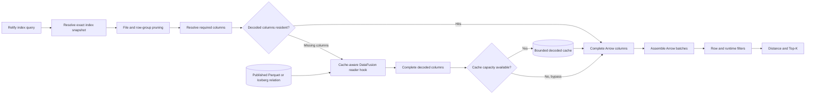
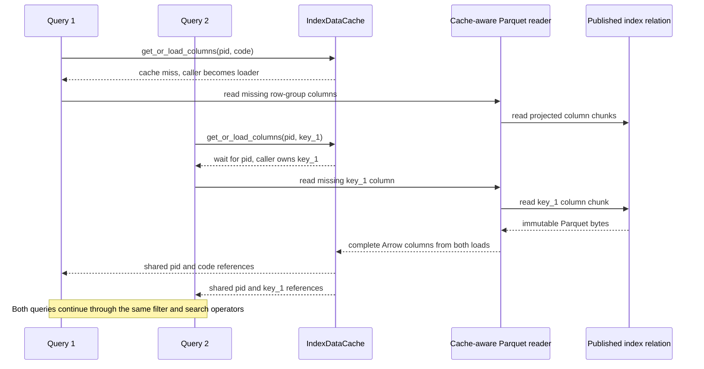
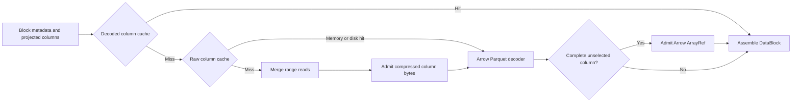

# Bounded Index Data Cache

## Summary

Replace the current all-or-nothing in-memory index path with a bounded,
read-through cache for decoded index data. Published Parquet or Iceberg data
remains the source of truth. A cache hit supplies decoded Arrow column arrays;
a miss uses the standard Arrow Parquet decoder through a narrow cache-aware
reader integration and may populate the cache. Queries use the same logical and
physical scan contract in both cases.

The first implementation covers index relations in the local DataFusion
backend. It does not cache source tables or introduce a persistent local copy
of an index.

## Motivation

The current `cache_index()` implementation materializes every relation in one
index snapshot. Cached IVF postings then use `CachedIvfScanExec`, while an
uncached query uses DataFusion's Parquet scan. This path was useful for
measuring in-memory performance, but it is not a stable serving architecture:

- an index must fit entirely in memory;
- cache memory has no capacity or eviction policy;
- cached and uncached queries use different scan implementations;
- warming a new snapshot duplicates substantial data before the old snapshot
  is released;
- repeated Parquet decoding is avoided only after explicit whole-index
  materialization.

The index files are already immutable, partitioned, and selectively scanned.
Relify should retain those properties and cache only the hot decoded row-group
columns that actual queries touch.

## Goals

- Keep published index relations as the only durable source of truth.
- Bound cache memory independently of total index size.
- Reuse decoded Arrow data across queries and avoid repeated Parquet decoding
  for hot columns.
- Preserve file and row-group pruning before cache lookup.
- Preserve projection, filtering, distance, and Top-K semantics across hits and
  misses.
- Use one cache-aware index scan contract instead of separate memory-only and
  storage-backed query implementations.
- Remain correct during concurrent queries, eviction, index refresh, and
  session shutdown.
- Provide enough metrics to distinguish storage I/O, Parquet decoding, cache
  lookup, and vector computation.

## Non-Goals

- Caching arbitrary source tables or SQL query results.
- A generic cache for every DataFusion data source.
- A distributed cache shared by multiple processes or machines.
- A persistent cache that must survive process restart.
- Reimplementing Parquet decoding.
- Adding a raw byte-range or local-disk cache in the first implementation.
- Automatically choosing a cache capacity from machine memory.

## User Experience

An index query always reads the current immutable index snapshot. When an
eligible decoded row-group column is resident, the query reuses it. Otherwise,
Relify reads and decodes the column from the published relation. The query
result does not depend on whether any column was cached.

The cache has a session-level byte capacity. A zero capacity disables decoded
data caching without changing the scan plan's semantics. The default capacity
is left unresolved by this RFC.

Read-through loading is automatic. The existing `cache_index()` and
`is_index_cached()` methods describe whole-index residency and do not fit a
partially resident cache; this RFC removes them. An explicit clear operation
and cache statistics replace `uncache_index()` and the boolean status method.
Workload-directed prewarming can be designed separately if cold-query latency
requires it.

## Interfaces

### Session API

Cache capacity is a Relify session variable rather than a `connect()` argument:

```python
session.set("relify.index_cache_capacity", "4GiB")
```

The value accepts integer bytes or the binary suffixes `KiB`, `MiB`, and
`GiB`. `Session.set()` applies the change eagerly to the current session.

The same variable is visible to SQL:

```sql
SET relify.index_cache_capacity = '4GiB';
```

`0` disables admission and releases unpinned entries. Reducing the capacity
removes least-recently-used entries from lookup immediately. Memory pinned by
running queries is released when those queries finish. Invalid sizes fail
without changing the current capacity.

The session exposes two operational methods:

```python
stats = session.index_cache_stats()
session.clear_index_cache()                         # all indexes
session.clear_index_cache("documents_embedding")   # one logical index
```

`clear_index_cache()` removes entries from future lookup but does not cancel or
alter running queries. Clearing an index covers all of its snapshot identities
still present in the session cache.

`index_cache_stats()` returns an immutable `IndexCacheStats` value:

```python
@dataclass(frozen=True)
class IndexCacheStats:
    capacity_bytes: int
    resident_bytes: int
    retired_bytes: int
    entry_count: int
    hit_count: int
    hit_bytes: int
    miss_count: int
    miss_bytes: int
    load_count: int
    load_wait_count: int
    admission_count: int
    eviction_count: int
    oversized_bypass_count: int
    capacity_bypass_count: int
```

`resident_bytes` includes entries removed from lookup but still pinned by a
running query; `retired_bytes` is the subset no longer available for lookup.
`entry_count` counts entries still available for lookup. Counters are
cumulative for the session and are not reset by a clear operation. Per-query
hit, miss, read, and decode metrics remain available through
`Session.analyze(query)`.

The existing `IndexCacheInfo`, `cache_index()`, `is_index_cached()`, and
`uncache_index()` APIs are removed. Relify has not published a stable release
that promises these whole-index semantics.

### Rust Cache Boundary

The cache implementation is private to `relify-local`; it is not a backend
contract and does not belong in `relify-core`. Its conceptual interface is:

```rust
#[derive(Clone, Eq, Hash, PartialEq)]
struct IndexColumnKey {
    relation: ExactRelationIdentity,
    object: ObjectIdentity,
    row_group: usize,
    column: PhysicalColumnIdentity,
}

struct DecodedIndexColumn {
    field: FieldRef,
    arrays: Arc<[ArrayRef]>,
    row_count: usize,
    retained_bytes: usize,
}

impl IndexDataCache {
    async fn get_or_load_columns<F, Fut>(
        &self,
        keys: &[IndexColumnKey],
        load_missing: F,
    ) -> Result<Vec<Arc<DecodedIndexColumn>>>
    where
        F: FnOnce(Vec<IndexColumnKey>) -> Fut,
        Fut: Future<Output = Result<Vec<(IndexColumnKey, DecodedIndexColumn)>>>;

    fn set_capacity(&self, bytes: usize);
    fn clear(&self, scope: CacheScope);
    fn stats(&self) -> IndexCacheStats;
}
```

These types describe ownership, not a public Rust API commitment. The cache
owns admission, per-column single-flight coordination, accounting, and
eviction. It passes only caller-owned misses to the load closure, allowing all
missing columns from one row group to be decoded in one projected reader pass.
The load closure owns storage access and decoding. This keeps the cache
independent of Parquet, Iceberg, DataFusion plans, and specific index families.

### DataFusion Scan Boundary

A cache-aware index relation provider owns the DataFusion integration. The
integration must run inside the Parquet reader boundary where the object,
physical row group, projection, and complete decoded output are known together.
It:

1. receives an exact relation identity and the normal DataFusion scan inputs;
2. delegates file listing, metadata, and pruning to the existing relation
   provider;
3. converts each required column of every surviving Parquet row group into a
   cache key;
4. looks up those decoded columns before row-group decoding;
5. invokes Arrow's standard Parquet decoder once for all missing columns in a
   row group and admits each complete, unfiltered column independently;
6. assembles cache hits and decoded misses into aligned Arrow batches without
   copying their buffers; and
7. returns ordinary Arrow batches to the downstream physical plan.

DataFusion 54 does not expose this decoded boundary through
`ParquetFileReaderFactory`: that interface supplies metadata and compressed
bytes below the decoder. `ParquetAccessPlan` can select row groups, but the
normal scan output is an untagged `RecordBatch` stream and cannot be safely
turned back into row-group column entries. The implementation therefore
requires a narrow hook around DataFusion's Parquet morselizer and Arrow decoder.
It may be implemented upstream in DataFusion or in a Relify-owned adapter, but
it must not fork or reimplement the Parquet decoder.

The provider is generic across Relify index relations. IVF planning may select
cluster files before calling it, but the provider and `IndexDataCache` have no
`cid`, distance, quantization, or Top-K API. Future index families reuse this
boundary without adding cache-specific branches to their search operators.

## Reference Design

### Architecture

The cache is inserted between physical pruning and the normal downstream
search operators. A hit and a miss converge on the same Arrow-column boundary:



The cache never becomes an alternative index representation. It retains the
same Arrow arrays produced by the storage-backed path and can be disabled
without selecting another query implementation.

### Ownership and Scope

`relify-local` owns one `IndexDataCache` per `LocalSession`. Catalog and
metadata crates remain independent of Arrow, DataFusion, and memory policy.
The cache accepts only relations belonging to a validated, published index
snapshot.

The cache is an execution resource. It is never serialized into index metadata
or the SQLite catalog. Closing the session releases it without changing the
published index.

### Source of Truth and Identity

Cache correctness relies on exact immutable relation identity:

- a managed Parquet relation is identified by its published index snapshot,
  relation role, and canonical object path;
- an Iceberg relation is additionally bound to its table UUID and exact
  snapshot ID;
- an object version or ETag is included when the storage implementation
  provides one.

Relify-managed index objects must not be overwritten after publication. When a
new index snapshot is published, its relation identity changes. Old cache
entries may be removed eagerly to reclaim memory, but identity separation, not
invalidation timing, provides correctness.

### Cache Unit

The logical cache unit is one complete, unfiltered decoded column from one
physical Parquet row group. In Parquet terms this corresponds to a column chunk;
in memory it is represented by one or more Arrow arrays because DataFusion may
split a large row group at its configured batch size. The arrays remain
independently reference counted and are not concatenated into a new buffer.

The key contains at least:

```text
exact relation identity
object path and available object version
row-group ordinal
physical field identity and type
column-chunk offset and length when available
```

The first implementation admits only top-level, non-nested index columns, for
which one logical column maps to one physical Parquet leaf. Nested columns must
bypass admission until their multi-leaf identity and reconstruction contract
are defined.

Filters, query vectors, `nprobes`, `k`, and the query projection as a whole are
not part of the key. File and row-group pruning happen before loading a column;
row-level filters and runtime filters are applied after the required complete
columns are assembled. Filtered or partially decoded output is not admitted
because it cannot be safely reused by another query. Physical field identity
includes the field path and type, not only the column name. Process restart
naturally separates entries decoded by different Relify or Arrow versions.

Row-group-column granularity is the proposed contract, not a requirement to
implement a new Parquet decoder. It does require a reader integration that can
intercept complete columns before row-level filtering. DataFusion's standard
Arrow decoder remains responsible for decompression, decoding, null handling,
and schema conversion. The first implementation must validate that this hook
can be maintained without copying DataFusion's Parquet reader.

Independent column entries preserve reuse across projections. A query that
needs `pid` and `code` can reuse a cached `pid` while decoding only `code`; a
later query that needs `pid` and `key_1` reuses the same `pid` entry. Missing
columns from one row group are decoded together so this granularity does not
turn one projected scan into one scan per column.

### Pruning and Filter Contract

The standard
[DataFusion 54 Parquet source](https://github.com/apache/datafusion/blob/54.0.0/datafusion/datasource-parquet/src/source.rs)
provides the following baseline:

| Capability | DataFusion 54 behavior |
| --- | --- |
| Projection pushdown | Reads and decodes only columns required by the physical projection and predicates. |
| Static I/O pruning | Uses partition values, file statistics, row-group statistics, Bloom filters, page indexes, and an optional external `ParquetAccessPlan`. |
| Decoder row filtering | Can decode predicate columns first and pass a `RowSelection` to later columns when pushdown filters are enabled. |
| Dynamic filters | Re-evaluates file-level pruning when opening a file and may stop an active file stream as the filter narrows. Row-group access plans are not continuously rebuilt from new dynamic-filter values after decoding starts. |
| Decoded-cache hook | Not exposed. `ParquetFileReaderFactory` operates below decoding, while `ParquetMorselizer` is crate-private. |

The cache must preserve DataFusion's storage optimizations:

| Optimization | Required cache behavior |
| --- | --- |
| File and row-group pruning | Apply partition, index, statistics, and Bloom-filter pruning before cache lookup. Pruned row groups create no cache traffic. |
| Column pruning | Construct keys only for columns required by projection, predicates, and downstream operators. Decode only missing required columns. |
| Page-index pruning | If a miss is decoded with a partial `RowSelection`, do not admit the partial arrays. The standard reader retains page-level I/O pruning. |
| Decoder row filtering and late materialization | A partial miss falls back to the standard reader and is not admitted. A complete cache hit may evaluate the same predicate after assembling the cached columns. |
| Dynamic filters | Preserve DataFusion's file-level pruning, early stopping, and row-level evaluation. Dynamic filter values never enter cache keys. Re-pruning each unopened row group from a newly updated filter is a future reader optimization, not a first-version requirement. |

The conservative first implementation may bypass decoded hits for a row group
when mixing them with a partial miss would require reproducing DataFusion's
`RowSelection` or late-materialization state. This gives up a possible cache hit
but preserves the standard cold path and all I/O pruning. Mixed hit and partial
miss execution can be added only after the reader hook exposes one authoritative
selection to both sides.

### Read Path

The cache-aware index scan performs these steps:

1. Resolve the exact published index snapshot.
2. Apply index pruning, including IVF cluster-to-file pruning.
3. Apply DataFusion file and row-group pruning.
4. Construct one key per required column of each remaining row group.
5. Return resident columns directly.
6. Decode all missing columns for a row group in one reader pass.
7. Admit only successfully and completely decoded columns.
8. Assemble aligned batches from hit and miss columns without copying buffers.
9. Apply row-level and runtime filters, then continue to distance and Top-K
   execution.

Hits and misses may occur in one query. Their output schema, partitioning, and
ordering contract must be identical. Cache-specific operators must not contain
IVF distance or Top-K logic; they only provide decoded index data.

### Concurrency

Concurrent misses for the same column key use single-flight loading. One task
reads and decodes the column while other tasks await the same result. A failed
or cancelled load is not cached, and another query may retry it. A multi-column
load claims all currently unowned misses before issuing one projected read;
overlapping queries wait only for columns already being loaded and may load
their remaining columns independently.



Cache values are reference counted. Eviction removes an entry from future
lookup but cannot invalidate a column held by a running query. Capacity
accounting must continue to include an evicted value until its final query
reference is released; otherwise concurrent scans can exceed the configured
budget by repeatedly replacing pinned entries.

When capacity cannot be reserved without violating the hard cache budget, a
miss remains a normal storage-backed read and bypasses admission. Cache
pressure must not fail an otherwise valid query.

### Capacity and Eviction

The cache is weighted by retained Arrow buffer bytes plus entry overhead, not
by row or entry count. The implementation must avoid double-counting shared
buffers across an entry's batch-sized arrays and must account conservatively
when exact ownership cannot be determined.

The first eviction policy is byte-weighted LRU. An entry larger than the total
capacity is never admitted. Admission occurs only after a complete column is
available, so a cancelled scan cannot leave a partial entry.

SLRU or frequency-aware admission may be added later if scans that are touched
once displace useful hot data. That policy change does not alter cache keys or
the scan contract.

The cache budget controls retained cache data. Temporary decoder buffers,
query output, distance state, and Top-K state remain query memory and continue
to follow DataFusion's execution-memory behavior.

### Existing Cache Migration

The final implementation removes the complete `CachedIndex` materialization,
`CachedIvfPostings`, `CachedIvfScanExec`, and the whole-index cache API.
Temporary coexistence is allowed only while performance and correctness are
compared during development.

The optimized cached postings scan currently maintains a `cid`-to-range
directory and over-partitions selected work. Equivalent cluster pruning and
parallelism must be preserved by planning physical files and row groups, not by
recreating a whole-index memory structure.

ADR 0001 remains the record of the first explicit cache design. Once this RFC
is implemented, a short follow-up ADR will mark that design as superseded.

### Observability

Session-level cache statistics must include:

- capacity, live bytes, and entry count;
- hit, miss, and single-flight wait counts;
- hit and miss bytes;
- admitted, evicted, oversized-bypassed, and capacity-bypassed entries;
- storage-read and decode time for misses.

The cache-aware scan must expose per-plan hit and miss metrics through
`EXPLAIN ANALYZE`. Metrics must make it possible to prove that a warm query did
not read or decode a resident column.

### Failure and Consistency Behavior

- Missing or corrupt cache data is treated as a miss; the published relation
  remains authoritative.
- A storage or decode failure is returned exactly as it would be without the
  cache.
- Publishing or selecting a new snapshot cannot return data from an older
  snapshot because its exact relation identity differs.
- Eviction and explicit cache removal do not affect already running queries.
- Cache entries are not written back to index storage.

## Rollout and Validation

Implementation proceeds in three stages:

1. Build a reader-hook prototype and prove that complete row-group columns can
   be intercepted before row-level filtering without copying DataFusion's
   Parquet decoder or changing results, projection, pruning, or runtime-filter
   behavior.
2. Add the bounded cache, single-flight loading, and metrics while retaining
   the old path only as a benchmark comparison.
3. Run correctness, concurrency, memory-pressure, GIST, and Wikipedia
   benchmarks, then remove the old complete-index path.

The implementation is ready to replace the old path only when it demonstrates:

- identical results for uncached, partially cached, and fully warm queries;
- no repeated Parquet decoding for cache hits;
- bounded live cache memory under concurrent eviction and pinned readers;
- no material cold-query regression attributable to cache integration;
- preserved scaling across configured DataFusion execution parallelism.

## Drawbacks

- A row-group column may still be too large for a small cache when an index was
  written with large row groups or unusually wide values.
- Coordinating per-column hits, in-flight loads, and one multi-column miss read
  is more complex than caching a complete projected row group.
- Applying row-level filters after cache lookup may give up decoder-level
  filtering for cacheable scans. The prototype must measure this tradeoff and
  preserve row-group pruning.
- A session-owned cache duplicates hot data across multiple sessions in one
  process.
- Reference-counted readers make strict accounting more complex than a simple
  LRU whose values are never pinned.

## Alternatives

### Keep the complete explicit cache

This gives the simplest warm path and strong benchmark performance, but it
requires the complete index to fit in memory and preserves two independent
scan implementations. It does not meet the serving or memory-safety goals.

### Cache compressed byte ranges only

A `ParquetFileReaderFactory` or object-store layer can cache remote byte
ranges. This is useful for object-storage latency but does not remove Parquet
decompression, decoding, or Arrow allocation, which remained material in local
profiling. It is a possible second cache level, not a replacement for the
decoded cache.

### Drive one standard scan per row group

Relify could attach a single-row-group `ParquetAccessPlan` to a cloned
`PartitionedFile`, execute an independent standard scan, collect all of its
batches, and split that result into column entries. This avoids modifying
DataFusion internals, but repeats reader, metadata, stream, and scheduling setup
for every row group. It also creates a second scan orchestration layer solely to
recover provenance that the standard output stream discarded. This is useful as
a feasibility experiment, not as the production architecture.

### Rely on the operating-system page cache

The OS page cache avoids repeated local disk I/O but still leaves Parquet
decoding and Arrow materialization on every query. It also provides no portable
control over remote object storage.

### Cache native vector-index structures

A purpose-built in-memory postings representation can be faster, but it creates
a second index representation with separate correctness, invalidation, and
scan semantics. This RFC keeps decoded Arrow columns reusable by the normal
relational execution path.

### Cache arbitrary DataFusion plans

`DataFrame.cache()` materializes a complete result as a memory table. It does
not provide bounded fragment admission or transparent partial hits and would
turn query-specific plans into cache keys. The proposed cache is limited to
immutable Relify index relations.

## Databend Reference Design

Databend is the closest reference for the decoded-cache idea, but its ownership
boundary is materially different from Relify's. The description below follows
Databend commit
[`3c73a7f`](https://github.com/databendlabs/databend/tree/3c73a7f73585d8ace3ffcd568c4bdc7dd30f71c0).

### Managed Physical Unit

The Fuse engine owns the writer, table metadata, reader, and cache. Its
[block writer](https://github.com/databendlabs/databend/blob/3c73a7f73585d8ace3ffcd568c4bdc7dd30f71c0/src/query/storages/fuse/src/io/write/block_writer.rs)
serializes one `DataBlock` into one Parquet object. The resulting `BlockMeta`
records the object location, row count, compression, and the physical offset and
length of each column. The
[Parquet block adapter](https://github.com/databendlabs/databend/blob/3c73a7f73585d8ace3ffcd568c4bdc7dd30f71c0/src/query/storages/fuse/src/io/read/block/parquet/deserialize.rs)
reconstructs one Parquet row group from those selected column chunks and emits a
single `RecordBatch`.

Databend's logical decoded-cache unit is therefore not an arbitrary row group
from an externally supplied Parquet file. It is one decoded column array from a
Fuse-managed block. Under the Fuse layout, that corresponds to one column of the
block's single Parquet row group.

### Two Data Cache Levels

For every projected column, the
[Fuse block reader](https://github.com/databendlabs/databend/blob/3c73a7f73585d8ace3ffcd568c4bdc7dd30f71c0/src/query/storages/fuse/src/io/read/block/block_reader_merge_io_async.rs)
checks these sources in order:

1. The in-memory decoded-column cache. A hit returns an Arrow `ArrayRef` and
   skips storage I/O, decompression, decoding, and Arrow allocation.
2. The raw column-data cache. This is a hybrid memory and local-disk cache of
   compressed Parquet column-chunk bytes. A disk hit is promoted into its memory
   tier, but still requires Parquet decoding.
3. Object storage. Missed column ranges are coalesced by merge I/O, and the
   returned compressed bytes may be admitted to the raw cache.

Columns from all three sources are combined in one `BlockReadResult`, so a scan
may reuse one decoded column, decode another from local raw bytes, and fetch a
third from object storage. The read hierarchy is:



The decoded cache is a byte-bounded in-memory LRU. Its weight is the Arrow
array's reported memory size. The raw cache is independently bounded and may
use both memory and disk; disk population is asynchronous. Databend can release
the in-memory decoded and raw tiers under memory pressure without changing the
Fuse table on object storage.

### Key and Admission Rules

Both cache levels use:

```text
block path
column ID
column-chunk offset
column-chunk length
```

The physical offset and length distinguish rewritten layouts even when a
logical column ID is unchanged. Because Fuse plans reads from block metadata
and controls block publication, the reader has all four fields before it reads
or decodes the column.

The decoded cache admits only non-nested columns decoded without a row
selection. A selected or partially decoded column is not reusable and is not
admitted. When a complete decoded array is already cached, a later query may
apply its row selection to that array after the hit. This preserves reuse across
different predicates while preventing filtered results from entering the
cache. These rules are implemented directly in Databend's
[Parquet deserializer](https://github.com/databendlabs/databend/blob/3c73a7f73585d8ace3ffcd568c4bdc7dd30f71c0/src/query/storages/fuse/src/io/read/block/parquet/mod.rs).

### Differences from Relify

| Dimension | Databend Fuse | Proposed Relify cache |
| --- | --- | --- |
| Ownership | One engine owns writing, metadata, pruning, reading, decoding, and caching. | Relify owns immutable index relations but executes them through DataFusion and Arrow interfaces. |
| Durable format | Fuse-managed block objects and Fuse snapshot metadata; each block is written as one Parquet object. | Open Parquet or Iceberg index relations intended to remain queryable outside Relify. |
| Decoded unit | One Arrow array for one column of a Fuse block. | One row-group column, represented by one or more batch-sized Arrow arrays. |
| Projection reuse | Independent column entries allow partial hits across different projections. | Independent column entries provide the same reuse; one miss read may populate multiple columns. |
| Raw cache | Hybrid memory and local-disk cache of compressed column chunks. | Explicitly outside the first implementation. |
| Reader boundary | Cache lookup and admission are inside `BlockReader` and its Parquet deserializer. | Requires a new hook around DataFusion's row-group decoder; the existing public reader factory is below that boundary. |
| Filtering | Full columns are admitted only without row selection; selections may be applied after a decoded hit. | Complete unfiltered columns are admitted; partial decoder output bypasses admission. |
| Identity | Block path, column ID, physical offset, and physical length. | Exact index relation and snapshot, object identity and version, row-group ordinal, and physical column identity. |
| Scope | General Fuse table data, managed as a node-level engine cache. | Relify index relations in one local session; source-table data is initially excluded. |

Relify should copy the separation of decoded and raw cache levels, immutable
physical identities, per-column granularity, and unfiltered admission rule. It
cannot copy Databend's placement without also owning a reader boundary. The
first Relify milestone is
therefore a reader-hook feasibility result, not the cache policy itself. If that
hook cannot be implemented or upstreamed without maintaining a fork of
DataFusion's Parquet reader, this decoded column design should not proceed.

## StarRocks Reference Design

StarRocks also integrates caching into readers it owns. The external Parquet
path and the native Segment path use the same process-level cache manager but
cache different physical objects. This description follows StarRocks 4.1.1.

### External Parquet Cache Levels

The external Parquet path may use two cache levels:

1. [`CacheInputStream`](https://github.com/StarRocks/starrocks/blob/4.1.1/be/src/io/cache_input_stream.cpp)
   caches fixed-size ranges of the remote object. The block cache may have
   memory, local-disk, and peer-cache sources. Its file identity is derived from
   the path plus modification time, or file size when modification time is not
   available; the block offset selects the cached range. A hit avoids remote
   I/O but still requires Parquet decompression, encoding decode, and column
   materialization.
2. [`parquet::PageReader`](https://github.com/StarRocks/starrocks/blob/4.1.1/be/src/formats/parquet/page_reader.cpp)
   checks `StoragePageCache` by file identity and Parquet page offset. The entry
   contains the page header and payload. Depending on the compression ratio,
   StarRocks stores either compressed payload or decompressed payload. A
   decompressed-page hit also skips decompression, but the Parquet page remains
   encoded and must still be decoded into vectorized columns.

This answers the reader-boundary question directly: StarRocks did not attach a
decoded cache outside a generic Parquet scan. It implements and owns the C++
Parquet `FileReader`, `GroupReader`, column readers, and `PageReader`, with cache
lookup and admission inside that stack.

The native Segment path is similar but uses StarRocks' own page format.
[`PageIO`](https://github.com/StarRocks/starrocks/blob/4.1.1/be/src/storage/rowset/page_io.cpp)
checks `StoragePageCache`, then reads, verifies, decompresses, and performs its
storage-page decode before admission. The cached value is still a storage page,
not a fully materialized vectorized column.

### Pruning and Filtering

StarRocks keeps pruning decisions above the cache lookup:

- [`FileReader`](https://github.com/StarRocks/starrocks/blob/4.1.1/be/src/formats/parquet/file_reader.cpp)
  creates readers only for materialized columns. It rejects row groups using
  scan ranges, row-group statistics, Bloom filters, and page indexes before
  preparing their data readers.
- [`GroupReader`](https://github.com/StarRocks/starrocks/blob/4.1.1/be/src/formats/parquet/group_reader.cpp)
  collects I/O ranges only from selected columns. Predicate columns are read as
  active columns; other projected columns may be read lazily after the row
  filter has reduced the range.
- Runtime filters are checked before the next unopened row group is prepared.
  If current row-group metadata proves that the runtime predicate cannot match,
  that row group is skipped without data-page reads.
- The raw block cache may read beyond a requested page because it aligns reads
  to its fixed block size, but it does not cause the Parquet reader to scan
  unrelated columns or row groups.

### Differences from Relify

| Dimension | StarRocks external Parquet | Proposed Relify cache |
| --- | --- | --- |
| Reader ownership | StarRocks owns the complete Parquet reader and places both cache lookups inside it. | Relify uses DataFusion and Arrow and needs an explicit decoded-column hook. |
| Memory-cache unit | One Parquet page containing compressed or decompressed encoded data. | One completely decoded row-group column represented by Arrow arrays. |
| Work avoided by the highest hit | Remote I/O and sometimes decompression. | Remote or local I/O, decompression, Parquet encoding decode, and Arrow allocation. |
| Column reuse | Page entries are naturally reached only through selected column readers. | Column entries are directly reusable across different query projections. |
| Partial filtering | Page and late-materialization state remain inside the reader. | Partial decoder output is not admitted; the initial implementation may bypass hits to preserve the standard path. |
| Raw tier | Fixed-size memory, disk, and optional peer blocks. | Not included in the first implementation. |

StarRocks demonstrates how reader-owned caches preserve I/O, column, and
runtime pruning. Its Page Cache is not a substitute for Relify's proposed
decoded-column cache because it does not eliminate Parquet value decoding and
Arrow allocation, which are material costs in Relify's current profiles.

## Other Prior Art

[Velox](https://facebookincubator.github.io/velox/develop/memory.html)
combines a process-wide file cache with explicit memory-pressure reclamation.
These systems also own their storage readers; Relify must provide an explicit
boundary around DataFusion rather than importing an engine-specific reader.

## Unresolved Questions

The following decisions require review or prototype evidence before this RFC
is accepted:

1. Should `relify.index_cache_capacity` default to disabled or a fixed
   conservative size?
2. Can a decoded row-group-column hook be upstreamed to DataFusion, or
   implemented in Relify without copying and maintaining DataFusion's Parquet
   reader?
3. Can the first implementation safely combine complete column hits with
   partially selected misses, or must that row group bypass decoded hits?
4. Should Iceberg index relations enter the first implementation, or follow
   after the Parquet path is validated?
5. Does byte-weighted LRU resist the expected IVF access pattern, or is SLRU
   required from the start?

## Future Work

- Add a raw memory or local-disk byte-range cache below the decoded cache for
  remote object storage.
- Coordinate cache and DataFusion query memory through a shared memory
  arbitration mechanism when DataFusion exposes a suitable reclaim callback.
- Share immutable cache entries across compatible sessions in one process.
- Add asynchronous or workload-directed prefetching.
- Let additional index families reuse the same cache-aware relation scan.
