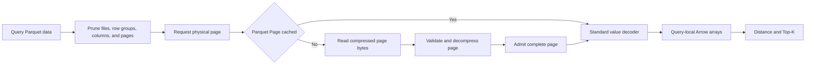

# ParquetPageCache

## Problem

Relify currently exposes two index scan paths:

- `cache_index()` materializes a complete index as decoded Arrow data;
- an uncached query reads Parquet through DataFusion.

The first path is fast only when the complete index fits in memory. It has no
capacity or eviction policy, duplicates data during snapshot refresh, and
implements scan behavior separately from the storage-backed path.

Relify needs one storage-backed path with a bounded read-through cache.
Published Parquet or Iceberg data remains authoritative. Query correctness must
not depend on which data is resident.

## Decisions

| Question | Decision |
| --- | --- |
| What is cached? | Complete, validated, decompressed Parquet pages. Values remain in their Parquet encoding. |
| What is the cache granularity? | One physical page from one leaf column in one Parquet row group. |
| Where is the cache integrated? | At the Page-provider boundary: lookup before Page-body I/O, admission after validation and decompression, and output before definition-level and value decoding. |
| How is pruning preserved? | File, row-group, column, and page pruning determine which pages are requested before cache lookup. |
| How are correctness and concurrency handled? | Immutable object identity, per-page single-flight loading, atomic admission, and reference-counted page buffers. |
| How is memory controlled? | A session-owned byte budget, allocation-lifetime accounting, oversized-page bypass, and byte-weighted LRU eviction. |

`ParquetPageCache` is a Parquet reader cache, not an Arrow column cache or the
operating system's file cache. Arrow arrays created by a query may reference
cached Page buffers, but arrays and execution batches are not cache entries.

## Scope

The cache abstraction is independent of vector indexes. The first
implementation enables it only for Parquet index relations in the local
DataFusion backend. It does not initially admit source-table Pages, query
results, or arbitrary DataFusion plans.

It also does not add:

- a persistent cache across process restarts;
- a cache shared by multiple processes;
- a local-disk cache;
- a replacement Parquet decoder;
- automatic cache sizing from machine memory; or
- a cache for non-Parquet formats.

## Architecture



Hits and misses return the same Parquet `Page` representation to the standard
decoder. The cache changes how a Page is obtained, not index semantics or query
results.

## 1. Cache Unit

### Cached value

A cache entry contains one complete Parquet `DataPage`, `DataPageV2`, or
`DictionaryPage` after decompression. It retains:

- the Page metadata required by the standard decoder;
- the decompressed, still encoded payload as reference-counted `Bytes`;
- the compressed span needed to advance the physical reader; and
- its retained-memory charge.

The cache never stores a filtered Page fragment. Row selections and runtime
filters are query state applied after lookup.

Each entry records the canonical physical span and decoded size:

```rust
struct PageDescriptor {
    page_type: PageType,
    compressed_range: Range<u64>,
    uncompressed_length: u32,
}
```

`compressed_range` starts at the Page header and ends after the compressed
body. Its end is also the next physical Page offset. The descriptor is cached
metadata used to advance the reader and validate other metadata; it is not part
of the cache key.

### Cache key

The conceptual key is:

```rust
struct ParquetPageKey {
    object_store: ObjectStoreIdentity,
    object: ImmutableObjectIdentity,
    page_offset: u64,
}
```

`page_offset` is the physical offset of the Page header. The object identity
includes the canonical path, size, and exact object version or ETag. The object
store identity prevents equal paths in different stores from colliding. A
Parquet object without an exact identity is not admitted unless its storage
contract guarantees immutability.

Row-group and leaf-column identity may be retained as entry metadata for
validation and diagnostics. They are not part of the key because an immutable
object and Page offset already identify the bytes, including when multiple
tables or snapshots reference the same object.

A caller may provide an expected Page span obtained from the Parquet offset
index. If it disagrees with the cached descriptor or the parsed Page header,
the reader reports corrupt or inconsistent metadata. It must not create another
entry for the same object and offset. Arbitrary `(offset, length)` reads belong
to a byte-range cache and are not accepted by `ParquetPageCache`.

### Why Page granularity

A Page is the smallest reusable Parquet unit that can be validated and
decompressed independently. It preserves column projection and page pruning,
does not depend on DataFusion batch boundaries, and has one clear backing
allocation for accounting and eviction.

Rejected units are:

| Unit | Reason not selected |
| --- | --- |
| Complete index | Requires the complete index to fit in memory. |
| File or row group | Retains unrelated columns and pages. |
| Decoded row-group column | Couples residency to Arrow materialization and batch assembly. |
| Compressed byte range | Is not Page-aware and still pays Page decompression on every hit. |
| Filtered Arrow batch | Is query-specific and unsafe to reuse. |

## 2. Reader Boundary

The relevant DataFusion path is:

```text
DataSourceExec
  -> FileStream / ParquetMorselizer
  -> ParquetPushDecoder
  -> Page production
  -> definition-level and value decoders
  -> RecordBatch
```

`AsyncFileReader` returns compressed file ranges. Caching those ranges is a
byte-range cache, not `ParquetPageCache`. The cache belongs at the next
boundary, where a reader can identify a physical Page and either:

1. return a resident decompressed `Page`; or
2. read its header and compressed body, validate and decompress it, atomically
   admit it, and return the same `Page` representation.

Lookup must happen before reading the Page body so a hit avoids storage I/O.
The cache key and cached Page metadata must also let the reader advance to the
next physical Page without reading the skipped body.

DataFusion 54's `ParquetFileReaderFactory` and `AsyncFileReader` expose byte
ranges below this boundary. `ParquetPushDecoder` does not currently expose a
public Page-provider hook. The first implementation gate is therefore a small
prototype that provides this boundary through either:

- a generic upstream Page-provider hook; or
- a Relify-owned cache-aware `PageReader` adapter that reuses arrow-rs Page and
  value decoders.

Relify must not fork or copy the Parquet decoder. A cache implemented only in
`AsyncFileReader`, or by retaining output `RecordBatch` objects, does not satisfy
this RFC.

The cache and adapter are generic index infrastructure. Their interfaces
contain no cluster, distance, quantization, or Top-K concepts.

## 3. PLAIN BYTE_ARRAY Fast Path

LVQ codes can be stored as required Parquet `BYTE_ARRAY` values using PLAIN
encoding. Their fixed byte length remains an index-schema requirement and is
validated when a Page is first consumed.

The DataFusion scan must request Arrow `BinaryView`. For a PLAIN `BYTE_ARRAY`,
arrow-rs parses each four-byte length prefix and creates query-local View
metadata whose payload points into the Page buffer. It does not copy the code
bytes.

```text
ParquetPageCache entry: decompressed PLAIN payload
                       |
                       +-- BinaryViewArray for query A
                       +-- BinaryViewArray for query B
```

The `BinaryViewArray` retains a reference to the Page buffer. Evicting the Page
from lookup cannot invalidate an array used by a running query. The allocation
is released only after both the cache and all active arrays drop their
references.

PLAIN does not remove all decoder work. Each query still parses length prefixes
and creates View metadata. It avoids payload materialization, which is the
dominant copy for large LVQ codes. Other Parquet types continue through their
standard decoders and may copy values into Arrow buffers.

## 4. Pruning and Filtering

Caching must not weaken the storage-backed scan path.

| Existing optimization | Required behavior with the cache |
| --- | --- |
| File pruning | Reject files before creating Page requests. |
| Row-group pruning | Reject row groups before creating Page requests. |
| Column projection | Request Pages only for projected leaf columns. |
| Page-index pruning | Do not look up Pages excluded by the selected access plan. |
| Predicate pushdown | Reuse Pages, then apply the query's predicate and row selection through the standard decoder. |
| Dynamic filters | Apply new pruning information to future Page requests; dynamic values never enter cache keys. |

A query that consumes only part of a Page may still admit the complete Page
because the cache entry is immutable and query-independent. Dictionary Pages
use the same cache and retain their normal dependency ordering within a column
chunk.

## 5. Consistency and Concurrency

Relify-managed index objects are immutable after publication. A new object
version receives a different identity, while snapshots that reference the same
immutable object safely reuse its Pages. Correctness does not depend on timely
invalidation by an index catalog.

An entry becomes visible only after the complete Page has been read, parsed,
decompressed, and structurally validated. Failed, partial, corrupt, or
cancelled loads are not cached. The original storage or decode error is
returned to the query.

Parquet CRC handling remains the responsibility of the standard reader when a
file provides it. CRC is not a cache key, descriptor field, or
`ParquetPageCache` requirement.

Concurrent misses for the same key use single-flight loading. One task reads
and prepares the Page; other tasks await the same result. Requests for different
Pages proceed independently.

Eviction and explicit clearing remove an entry from future lookup but do not
invalidate references held by running decoders or Arrow arrays.

## 6. Memory and Eviction

`relify-local` owns one `ParquetPageCache` per `LocalSession`. The cache is an
execution resource and is never serialized into index metadata or the catalog.
Closing the session releases its cache references.

Capacity is charged against the decompressed Page allocation and entry
overhead. The memory reservation remains attached to the backing allocation
until its final Page or Arrow reference is released. Removing a pinned entry
from LRU lookup therefore moves its bytes to a retired count; it does not
release the reservation early.

Query-local `BinaryView` metadata, numeric Arrow buffers, distance state, and
Top-K state are query memory rather than `ParquetPageCache` memory.

The initial policy is byte-weighted LRU. It must:

- bypass admission for a Page larger than the complete cache capacity;
- evict least-recently-used resident Pages before admission;
- include retired but pinned allocations in the memory budget; and
- allow a valid query to continue without admission under cache pressure.

Frequency-aware admission may replace LRU if benchmarks show that sequential
scans evict useful hot Pages.

## 7. Interfaces and Metrics

Capacity is a session variable:

```python
session.set("relify.parquet_page_cache_capacity", "4GiB")
```

The same variable is available through SQL:

```sql
SET relify.parquet_page_cache_capacity = '4GiB';
```

`0` disables admission and retires resident entries. Operational methods are:

```python
stats = session.parquet_page_cache_stats()
session.clear_parquet_page_cache()
```

The existing `cache_index()`, `is_index_cached()`, and `uncache_index()` APIs
are removed because bounded partial residency cannot be represented by a
whole-index boolean.

The private cache operation is conceptually:

```rust
async fn get_or_load_page(
    key: ParquetPageKey,
    load: LoadPage,
) -> Result<Arc<CachedParquetPage>>;
```

Session and `EXPLAIN ANALYZE` metrics must report:

- capacity, resident bytes, retired bytes, and Page count;
- Page hits, misses, single-flight waits, admissions, and evictions;
- hit, miss, compressed-read, and decompressed bytes;
- oversized and capacity bypasses; and
- storage-read, decompression, and value-decoder time.

A warm Page hit must perform no storage read or decompression. Value decoding
still occurs; the PLAIN `BYTE_ARRAY` fast path should show View construction
without payload copying.

## Rollout

1. Prototype the Page-provider boundary and prove that a hit avoids reading the
   compressed Page body while preserving the standard arrow-rs decoder.
2. Benchmark `FIXED_LEN_BYTE_ARRAY` materialization against PLAIN `BYTE_ARRAY`
   with `BinaryView` for complete Parquet scan, LVQ distance, and Top-K.
3. Implement identity, single-flight loading, accounting, eviction, and
   metrics.
4. Test cold, partial-hit, and warm scans under pruning, concurrent loads,
   cancellation, snapshot refresh, and memory pressure.
5. Run GIST and Wikipedia benchmarks, then remove the whole-index cache path.

The old path is removed only after the new path demonstrates:

- identical results for cold, partial-hit, and warm queries;
- no storage I/O or decompression for resident Pages;
- no LVQ code-payload copy on the PLAIN `BYTE_ARRAY` path;
- bounded memory with concurrent eviction and pinned readers;
- no material cold-query regression; and
- preserved pruning and parallel scaling.

## Prior Art

Databend and StarRocks place caches inside storage readers they own. Neither
provides a reader crate that Relify can adopt unchanged.

| System | Cache design | Difference from Relify |
| --- | --- | --- |
| Databend Fuse | Decoded block columns and compressed column-chunk bytes | Fuse controls its writer, block metadata, and Parquet deserializer; a managed block is typically one single-row-group file. |
| StarRocks external Parquet | Remote byte-range cache plus Page caching in its Parquet reader | StarRocks owns the full file, row-group, column, and Page reader stack. This is the closest architectural boundary. |
| Relify | Decompressed Parquet Pages consumed by arrow-rs decoders | Relify keeps open Parquet files and must add a narrow Page-provider boundary to DataFusion's reader. |

The PLAIN `BYTE_ARRAY` layout changes the trade-off relative to Databend's
decoded-column cache. The Page payload can remain authoritative in memory while
Arrow `BinaryView` arrays reference it directly, so Relify does not need a
second decoded representation for LVQ codes.

Relevant implementations:

- [DataFusion 54 Parquet source](https://github.com/apache/datafusion/blob/54.0.0/datafusion/datasource-parquet/src/source.rs)
- [arrow-rs 58 PageReader](https://github.com/apache/arrow-rs/blob/58.3.0/parquet/src/column/page.rs)
- [Databend Fuse block reader](https://github.com/databendlabs/databend/blob/3c73a7f73585d8ace3ffcd568c4bdc7dd30f71c0/src/query/storages/fuse/src/io/read/block/block_reader_merge_io_async.rs)
- [StarRocks Parquet page reader](https://github.com/StarRocks/starrocks/blob/4.1.1/be/src/formats/parquet/page_reader.cpp)

## Alternatives

- **Complete explicit cache:** provides the fastest warm path but requires the
  complete index to fit in memory and preserves two scan implementations.
- **Decoded row-group-column cache:** avoids repeated value decoding but couples
  residency to Arrow materialization and complicates batch alignment, Page
  pruning, and shared-buffer accounting.
- **Compressed byte-range cache:** avoids remote reads but repeats Page parsing,
  decompression, and value decoding. It may become a lower cache tier.
- **OS file cache:** helps local file I/O but not remote object stores or
  Parquet decompression. It is separate from `ParquetPageCache`.
- **Native vector structures:** may be faster but create another index format
  and separate scan semantics.

## Unresolved Questions

1. Can the Page-provider boundary be implemented as a narrow maintained adapter
   without copying the arrow-rs decoder?
2. How should the reader discover and key Pages before body reads when a file
   has no Parquet offset index?
3. What Page size best balances I/O pruning, decompression, View metadata, and
   cache admission for LVQ codes?
4. Should the default capacity be zero or a conservative fixed size?
5. Is byte-weighted LRU sufficient for IVF access patterns, or is admission
   control required initially?
6. Should Iceberg enter the first implementation or follow the local Parquet
   prototype?

## Future Work

- Add a compressed memory or local-disk byte-range cache below
  `ParquetPageCache`.
- Coordinate `ParquetPageCache` and DataFusion query memory under shared
  pressure.
- Share immutable Page entries across compatible sessions.
- Add workload-directed Page prefetching.
- Reuse the page-aware scan path across additional index families.
