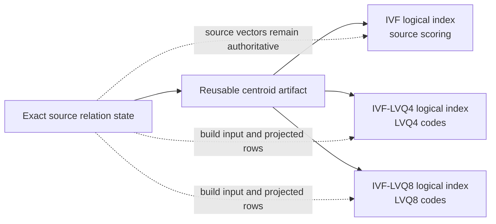
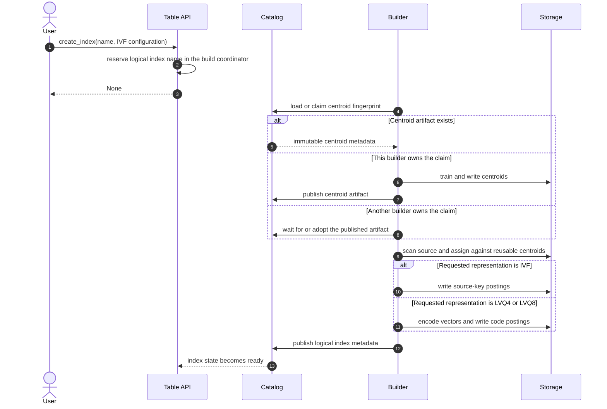

# Reusable IVF Centroids and Cosine Support

## Problem

IVF, IVF-LVQ4, and IVF-LVQ8 indexes over the same source can use the same
coarse centroids, but each representation requires different postings. The
reusable object must therefore be the centroid relation, not another logical
IVF index and not its postings.

The current schema also supports only squared Euclidean distance and requires
source vectors to be `list<float>`. This prevents Relify from indexing datasets
that store vectors as `list<double>`, including the Cohere datasets used by
VectorDBBench. The `flat` postings encoding works around source access by
copying full vectors into the index, which conflicts with the goal that source
data remains authoritative and is not duplicated by Relify.

This RFC separates the reusable IVF structure from its vector encoding and
adds cosine distance by mapping it to squared-L2 over normalized vectors.

## Decisions

| Question | Decision |
| --- | --- |
| Which logical index types are supported? | IVF, IVF-LVQ4, and IVF-LVQ8. |
| Are source vectors copied into an index? | No. The `flat` encoding is removed. |
| What is reused? | Only centroids for the bound source state. |
| When are centroids reused? | Automatically for the same source state, vector-index definition, and `nlist`. |
| How are postings built? | Every logical index scans the source, assigns rows against the reusable centroids, and writes exactly one postings relation in its own encoding. |
| Are encoding files positionally aligned? | No. Every encoding row carries its own cluster ID and source key. |
| Which source vector element types are accepted? | `float` and `double`; index computation canonicalizes both to `float`. |
| How is cosine implemented? | Normalize canonical source and query vectors, reuse the squared-L2 path, and divide reported distances by two. |
| How is a build observed? | `create_index` returns `None`; status and waiting remain index-name operations. |
| Are old IVF schemas retained? | No. Existing indexes must be rebuilt for the new schema. |

## Scope

This RFC defines:

- the identity and lifecycle of an IVF centroid artifact;
- the relationship between that artifact and logical indexes;
- the source, LVQ4, and LVQ8 representations;
- cosine and source-vector type semantics;
- automatic reuse, publication, failure, refresh, and garbage collection; and
- the public build API behavior.

It does not add product quantization, batch queries, incremental clustering,
or exact reranking of LVQ results. It also does not require two builders to
produce bit-identical centroids or codes.

## Architecture

An IVF centroid artifact is immutable and bound to one exact source state.
Logical indexes refer to it and own the postings required by their
representation.



The source table is never rewritten. Centroids and LVQ codes are derived index
data; neither is a copy of the original vector column.

### Terms

- **IVF centroid artifact**: immutable centroids and their source binding.
- **Centroid identity**: the semantic descriptor used to find or create an IVF
  centroid artifact.
- **Logical index**: the user-named, queryable IVF, IVF-LVQ4, or IVF-LVQ8
  object published through the ordinary index catalog.
- **Representation**: `source`, `lvq4`, or `lvq8`, selected by one logical
  index.

## 1. Centroid Identity

Two builds reuse centroids only when all fields in this descriptor match:

| Field | Reason |
| --- | --- |
| Source relation identity and exact state | Centroids are trained for one source state. |
| Vector field | Different columns define different vector spaces. |
| Dimension | Centroids and vectors must have the same width. |
| Metric | L2 and normalized-cosine clustering are different. |
| `nlist` | The cluster count is part of the coarse model. |
| Clustering profile version | A future incompatible training contract must not silently reuse an older artifact. |

The relation profile defines source identity and exact state. For Iceberg this
includes the table UUID and snapshot ID. Parquet has no snapshot identity: its
canonical URI is treated as the state key, and the user must keep the resolved
files unchanged. Replacing files or changing the files matched by a URI pattern
requires registering the changed data under a new URI before building another
index. Relify does not compute a Parquet file-manifest fingerprint in this RFC.

The Parquet rule is deliberately literal:

- rebuilding another representation from the same URI is safe only while the
  resolved file set and every file's bytes remain unchanged;
- appending, deleting, or overwriting a file behind the URI, including changing
  the expansion of a wildcard URI, makes reuse unsafe;
- changed data must be published at a different canonical URI, which produces a
  different centroid fingerprint even when its schema and row count are
  unchanged;
  and
- changing only the URI also produces a different source state. This RFC does
  not infer byte equivalence between two Parquet locations.

The catalog therefore treats equal Parquet URIs as equal source states and
different Parquet URIs as different source states. It cannot reject an unsafe
same-URI overwrite because that mutation is not represented in metadata; such
an overwrite is a source-contract violation by the caller.

The canonical descriptor is hashed to produce a centroid fingerprint. The hash
is a lookup key, not sufficient proof of compatibility: a catalog entry
retains the complete descriptor and readers verify it after lookup.

For one source state and vector-index definition, `nlist` is the only
user-selected field that distinguishes coarse partitions. The other identity
fields prevent accidental reuse across different columns, metrics, or schema
contracts.

`posting_encoding`, logical index name, builder implementation, physical file
layout, compression, and writer parallelism are not part of centroid identity.
The first successfully registered artifact for an identity becomes the
canonical one. Later builds consume its published centroids rather than
training an equivalent model independently.

## 2. Catalog Model

The catalog manages two namespaces of state:

1. user-visible logical indexes, addressed by the existing index identifier;
2. IVF centroid artifacts, addressed internally by centroid fingerprint.

The centroid registry is not exposed by `list_indexes`. A plain IVF logical
index is still user-visible; it uses the reusable centroids and owns its
source-key postings like every other logical index.

Conceptually, the catalog adds these internal operations:

| Operation | Semantics |
| --- | --- |
| `load_ivf_centroids(fingerprint)` | Return the matching ready artifact or no match. |
| `claim_ivf_centroids(fingerprint, descriptor)` | Atomically claim construction when no compatible artifact exists. |
| `publish_ivf_centroids(claim, metadata_location)` | Make one complete immutable artifact reusable. |
| `abandon_ivf_centroids(claim, error)` | Record the failure and make the fingerprint claimable by a later build. |

A claim has an owner and lease so another process does not wait forever after
a builder terminates. Catalog implementations may use a database row,
metastore entry, or another compare-and-swap mechanism. They must not discover
reuse by scanning user-visible index names.

Logical index metadata references the centroid artifact by fingerprint, stable
artifact UUID, and immutable metadata location. A reader validates that the
artifact descriptor matches the logical index snapshot before using it.

Reuse is limited to one catalog trust domain and remains subject to ordinary
source and index authorization. A builder must be able to resolve the relation
profiles used by the centroid artifact. It must not train competing centroids
for the same fingerprint merely because its preferred physical writer is
different; physical replication of one artifact is outside this RFC.

## 3. Index Relations

### IVF centroid artifact

The centroid artifact contains one logical relation:

```text
ivf_centroids(cid, centroid)
```

### IVF

An IVF logical index owns source-key postings:

```text
ivf_postings(cid, key_1, ..., key_K)
```

Search selects clusters, resolves the posting keys to source rows, and computes
candidate distance from the source vector.

### IVF-LVQ4 and IVF-LVQ8

Each LVQ logical index owns one postings relation:

```text
ivf_postings(cid, key_1, ..., key_K, offset, scale, code)
```

The code schema and reconstruction rules remain encoding-specific. Every code
row identifies itself by `cid` and the source-key tuple. Correctness does not
depend on row position, file order, row-group boundaries, or alignment with
another logical index.

Building any logical index scans the source and assigns each vector against the
published centroids. An LVQ builder computes the assignment and code in the
same projection. It must not train a second centroid model. The source table is
not reordered or rewritten; physical writers may independently partition the
resulting postings by `cid`.

Every logical index stores its own `cid` and source keys. This permits cluster
pruning and direct scans without joining to another index. Full source vectors
are never duplicated.

## 4. Build and Publication

Creating any of the three logical index types follows one operation:



The user observes one logical build with phases such as `resolve_ivf`,
`train_ivf`, `assign_ivf`, `encode_lvq4`, `encode_lvq8`, and `publish`. Internal
artifact claims are not separate public build operations.

The centroid artifact is published before logical-index postings are built. If
the postings build fails, the completed centroids remain reusable. No failed
logical index is made ready. If two builders race, only the claim owner
publishes the centroids; a losing speculative build must discard its
unpublished data and use the winner.

A failed logical build retains a session-local status record so the caller can
inspect its error. It never treats partial files as a published index, and
unreferenced partial files become ordinary garbage-collection candidates.

## 5. Vector Types and Canonicalization

A source vector field may be either:

```text
list<float>
list<double>
```

The list and every element are required. Every vector must have the declared
dimension and contain only finite values.

Before training, assignment, LVQ encoding, or source scoring, each element is
converted to canonical `float`. Conversion must produce a finite value. This
keeps centroids, kernels, and persisted codes on one element type without
requiring a second double-precision index format.

Query vectors accept float- or double-valued inputs and are canonicalized to
`float` by the same rule. The source table remains unchanged; canonicalization
is part of index construction and query execution, not ETL.

## 6. Metrics

### Squared Euclidean distance

For `l2_squared`, canonical vectors are used without a pretransform. Existing
squared-L2 routing and candidate scoring remain unchanged.

### Cosine distance

For `cosine`, a canonical vector is divided by its L2 norm before it is used by
training, assignment, encoding, routing, or source scoring. A zero-norm vector
is invalid. An index build fails if any indexed source vector has zero norm; a
query fails if its query vector has zero norm.

Relify reuses squared-L2 execution over normalized vectors:

```text
cosine_distance(q, x) = squared_l2(normalize(q), normalize(x)) / 2
```

For non-zero vectors, this is the usual cosine distance:

```text
squared_l2(normalize(q), normalize(x)) / 2
    = (2 - 2 * dot(normalize(q), normalize(x))) / 2
    = 1 - cosine_similarity(q, x)
```

The result is in `[0, 2]` up to floating-point error. Orthogonal vectors have
distance `1`; a negative similarity produces a distance greater than `1`.
Norms are accumulated with at least binary64 precision over canonical float
elements. Zero norm means that every canonical element is zero; there is no
configurable epsilon threshold. Normalization must produce finite canonical
float elements or the build or query fails.

The division is applied to retained results rather than every candidate because
it does not change ordering. Metadata records `metric = cosine`; normalization
and result scaling are metric semantics, not independently configurable
metadata fields.

Centroids are trained from normalized canonical vectors. Assignment and query
routing use the existing squared-L2 distance to those persisted centroids. A
query must not normalize a stored centroid independently because the published
centroid values define the IVF partitioning.

For IVF source scoring, `_distance` is the exact cosine distance of the
canonical source and query vectors. LVQ4 and LVQ8 encode the normalized source
vector and reconstruct an approximation `x_hat`. Search computes
`squared_l2(normalize(q), x_hat) / 2`, which approximates the squared-L2 distance
to the normalized source vector and therefore approximates cosine distance.
The reconstructed vector is not normalized again; deviation from unit norm is
part of the LVQ reconstruction error.

The metric is part of centroid identity. L2 and cosine logical indexes never
share centroids.

## 7. Query Paths

```text
IVF:
  query transform
    -> centroid routing
    -> selected source-key postings
    -> source resolution
    -> source-vector transform and distance
    -> Top-K

IVF-LVQ4 / IVF-LVQ8:
  query transform
    -> centroid routing
    -> selected code files
    -> source resolution before Top-K when required by a source filter
    -> reconstructed-vector distance
    -> Top-K
    -> source resolution when required by projection
```

LVQ postings contain `cid`, source keys, and codes. Source filtering may
introduce a source join before candidate selection, while source projection may
be resolved after Top-K. Both retain the exact source-state requirement.

## 8. Public API

Relify keeps one index-construction entry point:

```python
documents.create_index(
    "documents_lvq8",
    column="embedding",
    key=["document_id"],
    config=relify.IVF(nlist=8192, encoding="lvq8", metric="cosine"),
)
```

The canonical encoding names are `source`, `lvq4`, and `lvq8`; they correspond
to the user-facing IVF, IVF-LVQ4, and IVF-LVQ8 index types. There is no
`create_encoding` API. Creating an LVQ index automatically resolves or creates
its IVF centroid artifact. `source` is the default encoding and `l2_squared` is
the default metric.

`create_index` remains a command and returns `None`. Construction may outlive
the submitting call, so status is addressed by logical index name rather than
a public future:

```python
documents.create_index(...)
status = documents.index_status("documents_lvq8")
documents.wait_for_index("documents_lvq8")
```

`wait_timeout` remains available on `create_index` for callers that want one
blocking call. `index_status` exposes the current centroid or postings phase.

This API shape follows
[LanceDB's Python API](https://lancedb.github.io/lancedb/python/python/) and
remains usable by local, Spark, and future remote builders. In the first
implementation, an in-progress or failed build status is owned by the submitting
session. Only successfully published index metadata survives process exit.

### Future work: persistent build status

Persisting pending, running, failed, and resumable build jobs in a catalog is a
separate lifecycle design. It requires worker ownership, leases, retry policy,
and recovery semantics and is intentionally deferred from this RFC. The
name-based API leaves room for that design without exposing a session-local
future today.

## 9. Refresh, Drop, and Garbage Collection

An Iceberg source refresh produces a different exact source state and therefore
a new centroid fingerprint. Refresh builds or reuses the matching new centroid
artifact, builds the requested representation, and commits a new logical index
snapshot. It does not mutate the previous centroid artifact.

For Parquet, Relify cannot detect replacement at the same URI. The user must
publish changed source data under a new URI before rebuilding. Reusing centroids
after changing the files behind its Parquet URI violates the source contract.
For example, refreshing `s3://bucket/documents/v1/` without modifying that
prefix may reuse its centroids; overwriting a file under `v1/` and refreshing
may not.
The changed files must instead be published under a location such as
`s3://bucket/documents/v2/`, which forces a new source state and fingerprint.

Dropping a logical index removes only its catalog visibility. It does not
synchronously delete its IVF centroid artifact or postings files. Garbage
collection may remove an artifact only when it is unreachable from:

- every current or retained logical index metadata file;
- an active build claim; and
- the catalog's reader-safety retention window.

Reference counting is not part of the commit protocol. Reachability from
immutable metadata remains authoritative, avoiding races between concurrent
drop and create operations.

## 10. Compatibility and Migration

This change replaces the current IVF schema rather than adding compatibility
branches:

- schema-v1 `store_vectors` is removed;
- schema-v2 `posting_encoding = flat` is removed;
- centroids become an independently reusable artifact;
- source vectors may be `float` or `double`; and
- metrics are `l2_squared` and `cosine`.

Implementations reject old IVF metadata with an error that instructs the user
to rebuild the index. Relify has not published a stable index-format release,
so retaining read and write paths for the experimental schemas would impose
more complexity than the migration is worth.

## 11. Implementation Order

1. Define the new IVF-centroids and logical-index metadata schemas and fixtures.
2. Add catalog artifact lookup, claims, and reachability rules.
3. Split centroid training from each logical index's assignment and postings build.
4. Remove `flat` and old-schema implementation paths.
5. Accept `list<double>` sources and add canonical float conversion.
6. Add cosine normalization and result scaling to build and query paths.
7. Reuse the centroid artifact from the Spark builder and query backends.
8. Add concurrent-build, failed-postings, refresh, drop, and GC tests.
9. Benchmark L2 regressions and cosine Recall on the Cohere dataset.

## Alternatives Rejected

### Retrain each logical index

This preserves the current metadata model but wastes the dominant clustering
work. Each logical index still performs one assignment pass, but it does so
against the already published centroids.

### Share source-key assignments

Reusing a persisted `(source key, cid)` relation would avoid repeated centroid
distance calculations, but constructing an LVQ index would then require a
full source-to-assignment join. Source rows and assignments have no positional
alignment or common physical ordering. The first implementation keeps the
current fused assignment-and-encoding scan and shares only centroid training.

### Reuse only when explicitly requested

This exposes physical composition to users and makes the common path depend on
manual bookkeeping. Exact identity matching is sufficient for safe automatic
reuse.

### Match only on `nlist`

The same cluster count over a different source state, vector field, metric, or
dimension does not define the same partitioning.

### Align encoding files by row position

Positional coupling is fragile across writers and table formats. Repeating
cluster IDs and source keys is small compared with vector codes and preserves
ordinary relational semantics.

### Keep exact vectors in `flat` postings

This duplicates the largest source column and creates separate source and
index copies with independent lifecycle and I/O behavior. IVF source scoring
provides the exact reference path without that copy.

### Normalize the source table before indexing

Materializing a normalized table introduces ETL and another source copy.
Canonicalization belongs in the build and query pipelines.

### Fingerprint every Parquet source file

Hashing a resolved file manifest could detect changes behind one Parquet URI,
but adds listing, object-identity, persistence, and refresh semantics that the
current Parquet relation profile does not provide. The first implementation
retains its user-managed immutability contract. Iceberg remains the profile for
snapshot-identified source state.

### Return a session-local build handle

Name-based status works across local and external builders and does not expose
the current in-process coordinator. Persistent cross-process build status is
deferred separately.
