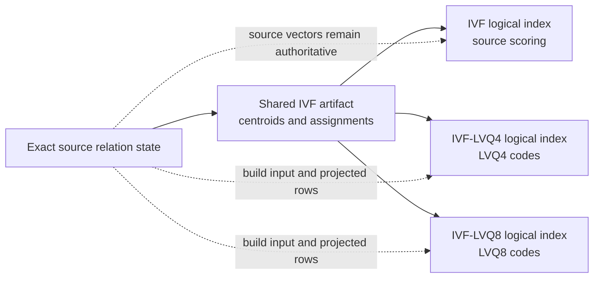
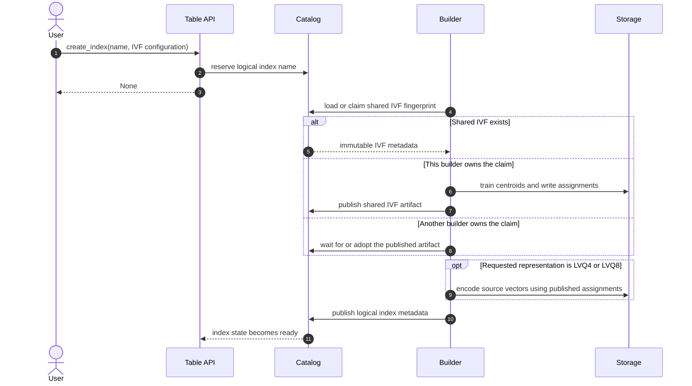

# Shared IVF and Cosine Support

## Problem

An IVF build currently publishes one self-contained index whose coarse
clustering and postings encoding are coupled. Building `source`, `lvq4`, and
`lvq8` indexes over the same source state therefore repeats centroid training
and point assignment even though those encodings need the same partitioning.

The current schema also supports only squared Euclidean distance and requires
source vectors to be `list<float>`. This prevents Relify from indexing datasets
that store vectors as `list<double>`, including the Cohere datasets used by
VectorDBBench. The `flat` postings encoding works around source access by
copying full vectors into the index, which conflicts with the goal that source
data remains authoritative and is not duplicated by Relify.

This RFC separates the reusable IVF structure from its vector encoding and
adds cosine distance without introducing a second query implementation.

## Decisions

| Question | Decision |
| --- | --- |
| Which logical index types are supported? | IVF, IVF-LVQ4, and IVF-LVQ8. |
| Are source vectors copied into an index? | No. The `flat` encoding is removed. |
| What does the shared IVF contain? | Centroids and one source-key-to-cluster assignment for the bound source state. |
| When is an IVF reused? | Automatically for the same source state, vector-index definition, and `nlist`. |
| Do LVQ encodings retrain, reassign, or reorder the IVF? | No. They encode vectors using the assignments of the shared IVF. |
| Are encoding files positionally aligned? | No. Every encoding row carries its own cluster ID and source key. |
| Which source vector element types are accepted? | `float` and `double`; index computation canonicalizes both to `float`. |
| How is cosine implemented? | Normalize canonical vectors, reuse squared-L2 training and search, and divide reported distances by two. |
| How is a build observed? | `create_index` returns `None`; status and waiting remain index-name operations. |
| Are old IVF schemas retained? | No. Existing indexes must be rebuilt for the new schema. |

## Scope

This RFC defines:

- the identity and lifecycle of a shared IVF artifact;
- the relationship between that artifact and logical indexes;
- the source, LVQ4, and LVQ8 representations;
- cosine and source-vector type semantics;
- automatic reuse, publication, failure, refresh, and garbage collection; and
- the public build API behavior.

It does not add product quantization, batch queries, incremental clustering,
or exact reranking of LVQ results. It also does not require two builders to
produce bit-identical centroids or codes.

## Architecture

A shared IVF artifact is immutable and bound to one exact source state. Logical
indexes refer to it and add only the data required by their representation.



The source table is never rewritten. Centroids and LVQ codes are derived index
data; neither is a copy of the original vector column.

### Terms

- **Shared IVF artifact**: immutable centroids, assignments, and their source
  binding.
- **IVF identity**: the semantic descriptor used to find or create a shared IVF
  artifact.
- **Logical index**: the user-named, queryable IVF, IVF-LVQ4, or IVF-LVQ8
  object published through the ordinary index catalog.
- **Representation**: `source`, `lvq4`, or `lvq8`, selected by one logical
  index.

## 1. Shared IVF Identity

Two builds reuse an IVF only when all fields in this descriptor match:

| Field | Reason |
| --- | --- |
| Source relation identity and exact state | Assignments are valid only for the indexed rows. |
| Vector field | Different columns define different vector spaces. |
| Ordered source-key fields | Assignments must resolve the same source rows. |
| Dimension | Centroids and vectors must have the same width. |
| Metric | L2 and normalized-cosine clustering are different. |
| `nlist` | The cluster count is part of the coarse model. |
| Clustering profile version | A future incompatible training contract must not silently reuse an older artifact. |

The relation profile defines source identity and exact state. For Iceberg this
includes the table UUID and snapshot ID. For Parquet it uses the canonical
relation reference and its immutable-file contract.

The canonical descriptor is hashed to produce an IVF fingerprint. The hash is
a lookup key, not sufficient proof of compatibility: a catalog entry retains
the complete descriptor and readers verify it after lookup.

For one source state and vector-index definition, `nlist` is the only
user-selected field that distinguishes coarse partitions. The other identity
fields prevent accidental reuse across different columns, keys, metrics, or
schema contracts.

`posting_encoding`, logical index name, builder implementation, physical file
layout, compression, and writer parallelism are not part of IVF identity. The
first successfully registered artifact for an identity becomes the canonical
one. Later builds consume its published centroids and assignments rather than
training an equivalent model independently.

## 2. Catalog Model

The catalog manages two namespaces of state:

1. user-visible logical indexes, addressed by the existing index identifier;
2. shared IVF artifacts, addressed internally by IVF fingerprint.

The shared-artifact registry is not exposed by `list_indexes`. A plain IVF
logical index is still user-visible; it is a lightweight reference to the same
artifact used by LVQ logical indexes.

Conceptually, the catalog adds these internal operations:

| Operation | Semantics |
| --- | --- |
| `load_shared_ivf(fingerprint)` | Return the matching ready artifact or no match. |
| `claim_shared_ivf(fingerprint, descriptor)` | Atomically claim construction when no compatible artifact exists. |
| `publish_shared_ivf(claim, metadata_location)` | Make one complete immutable artifact reusable. |
| `abandon_shared_ivf(claim, error)` | Record the failure and make the fingerprint claimable by a later build. |

A claim has an owner and lease so another process does not wait forever after
a builder terminates. Catalog implementations may use a database row,
metastore entry, or another compare-and-swap mechanism. They must not discover
reuse by scanning user-visible index names.

Logical index metadata references the shared artifact by fingerprint, stable
artifact UUID, and immutable metadata location. A reader validates that the
artifact descriptor matches the logical index snapshot before using it.

Reuse is limited to one catalog trust domain and remains subject to ordinary
source and index authorization. A builder must be able to resolve the relation
profiles used by the shared artifact. It must not train a competing IVF for the
same fingerprint merely because its preferred physical writer is different;
physical replication of one artifact is outside this RFC.

## 3. Index Relations

### Shared IVF artifact

The shared artifact contains two logical relations:

```text
ivf_centroids(cid, centroid)
ivf_assignments(cid, key_1, ..., key_K)
```

`ivf_assignments` contains exactly one row for every indexed source-key tuple.
It contains no source vector.

### IVF

An IVF logical index adds no vector representation. Search selects clusters,
reads their assignments, resolves source rows, and computes candidate distance
from the source vector.

### IVF-LVQ4 and IVF-LVQ8

Each LVQ logical index owns one encoding relation:

```text
ivf_codes(cid, key_1, ..., key_K, offset, scale, code)
```

The code schema and reconstruction rules remain encoding-specific. Every code
row identifies itself by `cid` and the source-key tuple. Correctness does not
depend on row position, file order, row-group boundaries, or alignment with
the assignments relation or another encoding.

Building an encoding reads the published assignments and source vectors. It
must reuse each assigned `cid`; it must not train centroids or assign points
again. Because assignments are already grouped by `cid` in the recommended
physical layout, a builder can encode them as a streaming pass without a new
global sort. Physical writers may independently partition files by `cid`.

Duplicating `cid` and source keys in an encoding is intentional. It permits
cluster pruning and direct scans without joining the codes to
`ivf_assignments`. Full source vectors are never duplicated.

## 4. Build and Publication

Creating any of the three logical index types follows one operation:



The user observes one logical build with phases such as `resolve_ivf`,
`train_ivf`, `assign_ivf`, `encode_lvq4`, `encode_lvq8`, and `publish`. Internal
artifact claims are not separate public build operations.

The shared IVF is published before an LVQ encoding is built. If encoding fails,
the completed IVF remains reusable. No failed logical index is made ready. If
two builders race, only the claim owner publishes an IVF; a losing speculative
build must discard its unpublished data and use the winner.

A failed logical build retains a non-queryable status record so the caller can
inspect its error. Retrying the same name atomically supersedes the failed
reservation; it never treats partial files as a published index. Unreferenced
partial files become ordinary garbage-collection candidates.

## 5. Vector Types and Canonicalization

A source vector field may be either:

```text
list<float>
list<double>
```

The list and every element are required. Every vector must have the declared
dimension and contain only finite values.

Before training, assignment, LVQ encoding, or source scoring, each element is
converted to canonical `float`. Conversion must produce a finite value. This
keeps centroids, kernels, and persisted codes on one element type without
requiring a second double-precision index format.

Query vectors accept float- or double-valued inputs and are canonicalized to
`float` by the same rule. The source table remains unchanged; canonicalization
is part of index construction and query execution, not ETL.

## 6. Metrics

### Squared Euclidean distance

For `l2_squared`, canonical vectors are used without a pretransform. Existing
squared-L2 routing and candidate scoring remain unchanged.

### Cosine distance

For `cosine`, a canonical vector is divided by its L2 norm before it is used by
training, assignment, encoding, routing, or source scoring. A zero-norm vector
is invalid. An index build fails if any indexed source vector has zero norm; a
query fails if its query vector has zero norm.

Relify then reuses squared-L2 execution over normalized vectors:

```text
cosine_distance(q, x) = squared_l2(normalize(q), normalize(x)) / 2
```

The division is applied to retained results rather than every candidate when
doing so does not change ordering. Metadata records `metric = cosine`; the
normalization and result scaling are metric semantics, not independently
configurable metadata fields.

Centroids are trained from normalized canonical vectors. Assignment and query
routing use the existing squared-L2 distance to those persisted centroids. A
query must not normalize a stored centroid independently because the published
centroid values define the shared IVF partitioning.

For IVF source scoring, `_distance` is the cosine distance of the canonical
source and query vectors. For LVQ4 and LVQ8, the normalized source vector is
quantized and `_distance` is half the squared-L2 distance to the reconstructed
vector. It is therefore an approximate cosine distance and may fall outside
the exact cosine range because quantization does not preserve unit norm. This
RFC does not add source reranking to LVQ queries.

The metric is part of shared IVF identity. L2 and cosine logical indexes never
share centroids or assignments.

## 7. Query Paths

```text
IVF:
  query transform
    -> centroid routing
    -> selected assignments
    -> source resolution
    -> source-vector transform and distance
    -> Top-K

IVF-LVQ4 / IVF-LVQ8:
  query transform
    -> centroid routing
    -> selected code files
    -> source resolution before Top-K when required by a source filter
    -> reconstructed-vector distance
    -> Top-K
    -> source resolution when required by projection
```

LVQ queries do not read `ivf_assignments` during candidate scoring because
their code rows already contain `cid` and source keys. Source filtering may
introduce a source join before candidate selection, while source projection may
be resolved after Top-K. Both retain the exact source-state requirement.

## 8. Public API

Relify keeps one index-construction entry point:

```python
documents.create_index(
    "documents_lvq8",
    column="embedding",
    key=["document_id"],
    config=relify.IVF(nlist=8192, encoding="lvq8", metric="cosine"),
)
```

The canonical encoding names are `source`, `lvq4`, and `lvq8`; they correspond
to the user-facing IVF, IVF-LVQ4, and IVF-LVQ8 index types. There is no
`create_encoding` API. Creating an LVQ index automatically resolves or creates
its shared IVF artifact. `source` is the default encoding and `l2_squared` is
the default metric.

`create_index` remains a command and returns `None`. Construction may outlive
the submitting call or process, so status is addressed by persistent logical
index name rather than a session-local future:

```python
documents.create_index(...)
status = documents.index_status("documents_lvq8")
documents.wait_for_index("documents_lvq8")
```

`wait_timeout` remains available on `create_index` for callers that want one
blocking call. `index_status` exposes the current shared-IVF or encoding phase.
The internal `BuildOperation` is not public API.

This model follows the persistent-resource behavior of
[LanceDB's Python API](https://lancedb.github.io/lancedb/python/python/) and
remains usable by local, Spark, and future remote builders. Catalog-backed build
reservations and leases allow another process to observe or recover an
incomplete operation; in-memory futures are only an implementation mechanism.

## 9. Refresh, Drop, and Garbage Collection

A source refresh produces a different exact source state and therefore a new
IVF fingerprint. Refresh builds or reuses the matching new shared IVF, builds
the requested representation, and commits a new logical index snapshot. It
does not mutate the previous IVF artifact.

Dropping a logical index removes only its catalog visibility. It does not
synchronously delete its shared IVF artifact or encoding files. Garbage
collection may remove an artifact only when it is unreachable from:

- every current or retained logical index metadata file;
- an active build claim; and
- the catalog's reader-safety retention window.

Reference counting is not part of the commit protocol. Reachability from
immutable metadata remains authoritative, avoiding races between concurrent
drop and create operations.

## 10. Compatibility and Migration

This change replaces the current IVF schema rather than adding compatibility
branches:

- schema-v1 `store_vectors` is removed;
- schema-v2 `posting_encoding = flat` is removed;
- centroids and assignments become a shared artifact;
- source vectors may be `float` or `double`; and
- metrics are `l2_squared` and `cosine`.

Implementations reject old IVF metadata with an error that instructs the user
to rebuild the index. Relify has not published a stable index-format release,
so retaining read and write paths for the experimental schemas would impose
more complexity than the migration is worth.

## 11. Implementation Order

1. Define the new shared-IVF and logical-index metadata schemas and fixtures.
2. Add catalog artifact lookup, claims, leases, and reachability rules.
3. Split local IVF training and assignment from representation construction.
4. Remove `flat` and old-schema implementation paths.
5. Accept `list<double>` sources and add canonical float conversion.
6. Add cosine transforms to build, source scoring, LVQ encoding, and query.
7. Reuse the shared artifact from the Spark builder and query backends.
8. Add concurrent-build, failed-encoding, refresh, drop, and GC tests.
9. Benchmark L2 regressions and cosine Recall on the Cohere dataset.

## Alternatives Rejected

### Retrain each logical index

This preserves the current metadata model but wastes the dominant clustering
work and may assign the same source rows differently for each encoding.

### Reuse only when explicitly requested

This exposes physical composition to users and makes the common path depend on
manual bookkeeping. Exact identity matching is sufficient for safe automatic
reuse.

### Match only on `nlist`

The same cluster count over a different source state, vector field, metric, or
dimension does not define the same partitioning.

### Align encoding files by row position

Positional coupling is fragile across writers and table formats. Repeating
cluster IDs and source keys is small compared with vector codes and preserves
ordinary relational semantics.

### Keep exact vectors in `flat` postings

This duplicates the largest source column and creates separate source and
index copies with independent lifecycle and I/O behavior. IVF source scoring
provides the exact reference path without that copy.

### Normalize the source table before indexing

Materializing a normalized table introduces ETL and another source copy.
Canonicalization belongs in the build and query pipelines.

### Return a session-local build handle

A local future cannot represent a Spark or remote build after the submitting
process exits. Name-based status and waiting match the lifetime of the
cataloged index.
