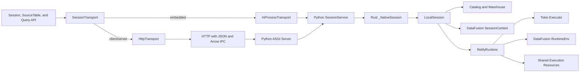
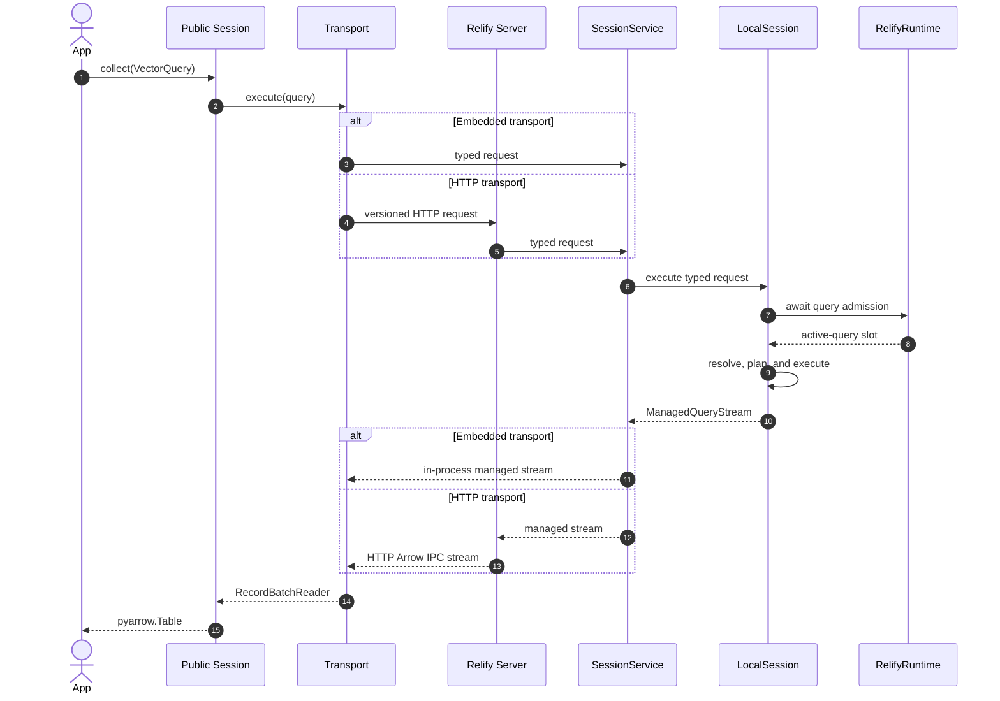

# Unified Embedded and Client/Server API

## Problem

Relify currently exposes its embedded DataFusion implementation directly:
`Session` inherits `SessionContext`, and `SourceTable` inherits DataFusion's
`DataFrame`. This is convenient locally, but it makes a client/server mode
impossible to add without either introducing a second public API or pretending
that process-local DataFusion objects can cross a network boundary.

Client/server execution is needed for concurrent serving. One server process can
own the execution runtime, catalog connections, and bounded caches while many
clients submit queries. A multiprocessing benchmark or application should not
create one independent Relify runtime and Page cache per worker.

The public API must not expose this deployment choice. After `connect`, source
registration, index lifecycle, query construction, execution, result schemas,
and errors must have the same behavior in embedded and client/server modes.

LanceDB provides the relevant API and protocol precedent. One `connect` entry
point selects a local or remote connection, while both implementations satisfy
the same connection, table, and query interfaces. Its REST Catalog also defines
operation models once and maps them to versioned HTTP routes with JSON metadata
and Arrow IPC data. Relify adopts both principles. It does not retain a public
compute-backend plugin layer: embedded and client/server requests both execute
through the same DataFusion engine.

References:

- [LanceDB `connect`](https://github.com/lancedb/lancedb/blob/main/python/python/lancedb/__init__.py)
- [LanceDB connection interface](https://github.com/lancedb/lancedb/blob/main/python/python/lancedb/db.py)
- [LanceDB table interface](https://github.com/lancedb/lancedb/blob/main/python/python/lancedb/table.py)
- [Lance REST Catalog](https://lance.org/format/catalog/rest/)
- [Lance Namespace OpenAPI specification](https://github.com/lance-format/lance-namespace/blob/main/docs/src/spec.yaml)

## Decisions

| Question | Decision |
| --- | --- |
| How does an application select the mode? | `relify.connect` selects embedded or client/server execution from the URI. |
| Does the mode change user operations? | No. Both modes return the same public `Session`, `SourceTable`, and query types. |
| Is asynchronous I/O supported? | Yes. `connect_async` provides matching `AsyncSession` and `AsyncSourceTable` facades for both deployment modes. |
| Which implementation is authoritative? | The asynchronous transport and service path. The synchronous API is a blocking facade over that path, not a second implementation. |
| Is compute execution a public plugin point? | No. The supported engine is DataFusion. External engines may use the open specification or a reference SQL compiler. |
| Where is query meaning defined? | A transport-neutral `VectorQuery` or SQL string describes the request. |
| Where is a request executed? | Both transports invoke the same session-service contract backed by DataFusion. |
| What is the remote protocol? | A versioned HTTP/HTTPS API described by OpenAPI. It follows the Lance REST Catalog operation and route model. |
| How are results transferred? | Metadata uses JSON. Query results use Arrow IPC streams over HTTP and are never converted to JSON by the SDK. |
| Is the DataFusion Python API part of the shared contract? | No. Engine-native objects are an explicit embedded-only escape hatch. |
| Are inherited DataFusion APIs preserved? | No. Relify exposes its own table, SQL, vector-query, index-lifecycle, and Arrow-result APIs instead of forwarding `SessionContext` or `DataFrame` methods. |
| Is a catalog object exposed to applications? | No. `Session` provides table registration and discovery; index lifecycle remains table-centered. |
| What does a path mean in client/server mode? | The execution process resolves it. A server must be able to access every registered URI. |
| Who owns runtime resources? | Embedded applications own them in process; in client/server mode the server owns them and shares bounded caches across requests. |
| Are runtime resources owned by a session? | No. A process-scoped `RelifyRuntime` owns shareable execution resources; one or more `LocalSession` instances use it for catalog-scoped execution. |
| How is query concurrency controlled? | Deployment settings independently limit process workers, per-query DOP, active queries, and queued queries. Remote requests cannot override them. |
| Is `query_dop` a strict CPU limit? | No. It is the DataFusion planning target for one query. The process worker count bounds the shared Tokio query executor. |
| Where does blocking catalog I/O run? | On a bounded blocking executor owned by `RelifyRuntime`, never on the ASGI event loop or query executor. |
| How are index names scoped? | By source table. The durable identity is the table identifier plus index name, so different tables may use the same index name. |
| Does client/server execution require session affinity? | No. Every request carries its query-affecting state. Server runtime state is shared but disposable. |
| Is the first server horizontally stateless? | No. The first deployment is single-instance because it uses SQLite and process-local build coordination. The protocol does not preserve that limitation. |
| Where is the first server implemented? | In Python as an ASGI application. It calls the same Python `SessionService` as embedded mode; Rust remains responsible for catalog, storage, planning, and DataFusion execution. |
| Can clients supply an index builder object? | No. Portable index requests contain only serializable index and writer configuration. Builder selection and resource limits are server responsibilities. |
| Is an accepted index build durable across server restart? | No. Published indexes are durable, but an in-progress build belongs to the first server process and may be abandoned when it exits. |
| How are table identifiers encoded on HTTP routes? | The request model carries identifier segments; the route uses the Lance delimiter convention and must decode to the same segments. |
| Can a remote client register any server-visible path? | No. The server accepts only source URI prefixes allowed by deployment configuration. |
| How is parity enforced? | One conformance suite runs the same operations against both transports. |

## API Contract

Only connection construction changes between modes:

```python
import relify

embedded = relify.connect("./relify-data")
remote = relify.connect("https://relify.example.com")
```

All ordinary operations are identical after connection:

```python
session = remote  # The same code also accepts `embedded`.

session.register_parquet(
    "documents",
    "s3://lakehouse/documents/*.parquet",
)

documents = session.table("documents")
documents.create_index(
    "document_embedding",
    column="embedding",
    key=["id"],
    config=relify.IVF(nlist=4096, encoding="lvq8", metric="cosine"),
)
documents.wait_for_index("document_embedding")

query = (
    documents.search(vector, column="embedding")
    .where("tenant_id = 42")
    .nprobes(64)
    .limit(10)
    .select(["id", "text"])
)

hits = session.collect(query)
```

### Public object model

The portable API contains five user-facing areas. Catalog storage, transport,
and server administration are not additional application objects.

#### Connection

| API | Result |
| --- | --- |
| `relify.connect(location, ...)` | One public `Session` facade backed by an in-process or HTTP transport. |
| `await relify.connect_async(location, ...)` | The corresponding `AsyncSession` facade. |
| `session.close()` | Release client or embedded resources. |
| `with relify.connect(...) as session` | Close the session when the context exits. |

Connection credentials, deadlines, and deployment configuration may differ by
URI. They do not change the methods available after connection.

#### Table registration and discovery

| API | Result |
| --- | --- |
| `session.register_parquet(name, uri, ...)` | Persist one Parquet source definition. |
| `session.deregister_table(name)` | Remove one persisted source definition. |
| `session.list_tables()` | Return registered table identifiers. |
| `session.table(identifier)` | Return a `SourceTable`. |

Relify does not expose `session.catalog`, `session.catalogs`, or a storage-level
catalog object. A session is already bound to one database catalog and acts as
the table-discovery facade. Qualified identifiers may represent namespaces
when the configured catalog supports them.

Catalog implementations and index metadata lookup remain internal service
interfaces. The existing `open_index_catalog` entry point is removed from the
ordinary public API instead of being proxied through the client/server
transport.

Not exposing a catalog object does not remove the catalog boundary. The first
implementation keeps SQLite as the embedded authority for source definitions,
published index metadata pointers, and reusable published artifact records. A
future server may replace it with a transactional shared implementation without
changing `Session` or `SourceTable`.

#### Table and index lifecycle

| API | Result |
| --- | --- |
| `table.identifier` | Stable table identifier. |
| `table.schema` | Portable Arrow schema. |
| `table.create_index(...)` | Submit an index build. |
| `table.index_status(index)` | Return the current `IndexStatus`. |
| `table.wait_for_index(index, ...)` | Wait for a terminal build state. |
| `table.list_indexes()` | Return portable `IndexInfo` values. |
| `table.refresh_index(index, ...)` | Rebuild and atomically replace an index. |
| `table.drop_index(index)` | Remove an index publication. |
| `table.search(vector, ...)` | Construct a `VectorQuery`. |

Index metadata publication remains an internal catalog responsibility. Users
address indexes through their source table rather than manipulating catalog
records or metadata locations.

An index name is unique within its source table, not across the catalog. Build
status, publication, refresh, and drop operations use the durable pair
`(table_identifier, index_name)`. Implementations must not key in-progress
builds or published indexes by the index name alone.

The portable index-construction signature is:

```python
table.create_index(
    index,
    *,
    column,
    key,
    config,
    writer_options=None,
)
```

`config` and `writer_options` are immutable, serializable values. The portable
API has no `builder` argument. In particular, a Python `IndexBuilder` or a local
thread-pool object cannot cross the transport boundary. The service selects an
installed implementation from the index configuration; build concurrency,
worker count, and memory limits are deployment settings. A future extension may
name a server-installed implementation with a string identifier, but it must
not transfer executable client objects.

#### Query construction

`VectorQuery` remains an immutable, transport-independent value and supports the
same query modifiers in both modes:

| API | Meaning |
| --- | --- |
| `select(columns)` | Project result columns. |
| `where(predicate)` | Add a SQL predicate. |
| `nprobes(count)` | Select the IVF probe count. |
| `limit(count)` | Select the result count. |
| `bypass_vector_index()` | Execute the reference path without an index. |

SQL does not require a public query wrapper. A statement is passed directly as
a string; the transport converts it into an internal request without exposing
that request type to applications. A `VectorQuery` contains no DataFusion plan,
network channel, or session reference.

```python
vector_query = documents.search(vector, column="embedding").limit(10)
sql = "SELECT category, COUNT(*) FROM documents GROUP BY category"

vector_hits = session.collect(vector_query)
category_counts = session.collect(sql)
```

The portable SQL surface initially accepts read-only query statements,
including projections, filters, joins, CTEs, aggregations, ordering, and
limits. DataFusion `SET`, DDL, temporary objects, and process-local UDF
registration are not portable SQL operations. `session.sql(statement)` executes
and collects the statement. Callers pass the same string to `stream`, `explain`,
or `analyze` when they need a different terminal operation.

#### Execution and results

| API | Result |
| --- | --- |
| `session.stream(query)` | `pyarrow.RecordBatchReader` |
| `session.collect(query)` | `pyarrow.Table` |
| `session.sql(statement)` | Convenience alias for `session.collect(statement)`. |
| `session.to_arrow(query)` | Compatibility alias for `collect`. |
| `session.explain(query, ...)` | Portable plan description. |
| `session.analyze(query)` | Executed plan and runtime metrics. |

The execution methods accept either `VectorQuery` or a SQL string. Empty results
retain the same schema in both modes. Streaming prevents a remote client from
materializing a large result before consuming it.

### Asynchronous API

Asynchronous I/O is independent of the deployment mode:

```python
session = await relify.connect_async("https://relify.example.com")
try:
    documents = await session.table("documents")
    query = documents.search(vector, column="embedding").limit(10)

    async for batch in session.stream(query):
        consume(batch)
finally:
    await session.close()
```

`AsyncSession` and `AsyncSourceTable` use the same operation names, request
models, result schemas, and exceptions as their synchronous counterparts.
Methods that only construct immutable queries remain synchronous. Operations
that access the catalog, submit work, wait for builds, or consume results are
awaitable.

The asynchronous implementation is authoritative for both transports. The
synchronous `Session` and `SourceTable` APIs invoke the same asynchronous
service through a private, long-lived blocking bridge. They do not maintain a
second service implementation or create a new event loop for each operation.

Native awaitables schedule work on the process `RelifyRuntime`; they do not
create an unrelated Tokio runtime. The Python event loop observes completion
and cancellation without polling DataFusion work itself.

`AsyncSession.stream` returns an asynchronous iterator of
`pyarrow.RecordBatch` values rather than pretending that the synchronous
`pyarrow.RecordBatchReader` is awaitable. Cancelling the consuming task or
closing the iterator cancels the HTTP request and propagates cancellation to
query execution.

Both transports receive a `ManagedQueryStream`, not a bare DataFusion
DataFrame. It owns the DataFusion stream, query cancellation token, and active
query admission slot. The slot is released exactly once when the stream is
exhausted, explicitly closed, cancelled, or dropped.

Index construction is asynchronous at the server as well. Calling
`await table.create_index(...)` returns after the live server's build
coordinator has accepted the request, not after it has completed. Calling
`await table.wait_for_index(...)` polls the same index status operation used by
the synchronous API without blocking the event loop. The first protocol does
not require WebSocket or server-sent-event state.

Acceptance is process-scoped in the first server. A server exit may abandon an
in-progress initial build, after which the index is not found, or an in-progress
refresh, after which the previously published snapshot remains ready. Partial
unpublished objects are handled by normal orphan cleanup. Published index
metadata is durable; the first release does not claim durable job queuing,
automatic build resumption, or persistent failure history.

### Reference SQL compiler

Support for an external SQL engine does not require a Relify Session, plugin,
capability matrix, or execution adapter. A separate reference compiler may
consume a `VectorQuery`, published index metadata, a SQL dialect, and explicit
relation bindings, and return generated SQL plus its result schema and required
relations.

The compiler does not connect to an engine, register tables, resolve engine
catalogs, execute queries, inspect engine versions, or promise a performance
profile. Its first useful scope is the UDF-free Level 0 query for a
source-encoded IVF index. Encodings that require an efficient native distance
kernel, including LVQ4 and LVQ8, are not forced through generic SQL.

### DataFusion escape hatch

The common `Session` must no longer inherit DataFusion `SessionContext`, and
`SourceTable` must no longer inherit DataFusion `DataFrame`. Arbitrary
DataFusion plans, Python callbacks, UDF objects, and process-local providers
cannot be serialized with stable semantics.

This deliberately removes inherited DataFusion methods from the Relify API,
including arbitrary UDF and `TableProvider` registration, direct runtime and
plan manipulation, and DataFrame chaining after `session.sql`. Relify does not
proxy these methods or maintain a compatibility forwarding layer. In
particular, `session.sql(statement)` returns a `pyarrow.Table`; it does not
return a DataFusion `DataFrame`.

An embedded session may expose its underlying context explicitly:

```python
context = session.datafusion_context()
```

This method raises `UnsupportedOperationError` on a client/server session. The
returned object follows the bundled DataFusion API and is outside Relify's API
compatibility and embedded/remote parity guarantees. Relify's own table, index,
and query implementations must not depend on applications using this escape
hatch. The normal SQL surface remains portable and executes through the session
service.

### URI and path semantics

An `http://` or `https://` URL identifies a Relify server. A filesystem path or
existing local catalog form selects embedded execution. Connection credentials
and timeouts are transport options; they do not alter table or query behavior.

Paths passed to operations are resolved by the process that executes the
operation:

- embedded mode resolves local paths in the application process;
- client/server mode resolves local paths in the server process; and
- object-store URIs are read by the execution process using its credentials.

`register_parquet` does not upload a client's local files. Applications that
need one source in both modes should use a shared URI or mount the same path in
the server environment.

Embedded mode applies the permissions of the application process. Client/server
mode additionally applies a deployment-configured allowlist of canonical source
URI prefixes. Bare paths and `file` URIs are rejected unless they resolve below
an allowed file root. Object-store URIs must match an allowed prefix, and clients
cannot attach storage credentials to a registration request. Credentials,
custom endpoints, and network access are configured by the server. The default
server allowlist is empty; a deployment must explicitly expose each source root.

### HTTP wire models

Service requests use typed values in process and JSON-compatible OpenAPI models
over HTTP. The HTTP adapter is the only layer that encodes or decodes wire
representations.

A table identifier is an ordered array of namespace segments followed by the
table name. The server catalog is selected by the connection and is not repeated
in every route. HTTP paths follow the Lance delimiter convention: segments are
joined with the `delimiter` query parameter, whose default is `$`, and each path
value is percent-encoded. A client must select a delimiter absent from the
segments. If an identifier is present in both the route and JSON body, the two
decoded segment arrays must match or the server returns `400 Bad Request`.

Portable request models contain no Python, PyArrow, or DataFusion objects:

- `VectorQuery`, index configuration, and writer options use JSON scalars,
  arrays, and tagged objects;
- an optional Arrow schema is encoded as an Arrow IPC schema message in an
  OpenAPI `string` with `byte` format;
- partition-column types use the same IPC schema representation; and
- file sort order contains field-name strings only.

The in-process transport constructs the same service models without base64 or
JSON conversion. The OpenAPI document is therefore generated from or checked
against the service operation models rather than maintained as an unrelated set
of HTTP structs.

### Arrow IPC stream codec

The HTTP transport encodes and decodes Arrow IPC incrementally. On the server,
one bounded encoder consumes a `ManagedQueryStream` and emits schema and batch
messages without collecting the result. Encoding work runs outside the ASGI
event loop, and the encoder retains at most one RecordBatch plus bounded output
chunks.

The asynchronous client feeds HTTP body chunks into an incremental Arrow IPC
stream decoder and yields each completed RecordBatch. It must not adapt the
asynchronous response to a synchronous PyArrow reader by buffering the complete
body or by creating one decoder thread per query. The synchronous client consumes
the same decoded stream through the private blocking bridge.

### HTTP protocol

Relify follows the Lance REST Catalog's operation-oriented protocol design
rather than translating the API into generic CRUD resources. Every public
operation has one transport-neutral request and response model. The embedded
transport calls that operation directly; the HTTP transport serializes the same
model as JSON or Arrow IPC.

This is a route-design precedent, not protocol compatibility. Relify operates
on registered external sources, open Relify indexes, vector queries, and SQL;
it does not implement Lance table, version, transaction, or query models.

Routes include the table identifier whenever an operation is table-scoped. This
lets a reverse proxy perform routing, authentication, authorization, and
request accounting without deserializing the body. The first protocol version
uses these routes:

| Operation | Route | Response |
| --- | --- | --- |
| List tables | `GET /v1/table` | JSON |
| Register a Parquet source | `POST /v1/table/{id}/register` | JSON |
| Describe a table | `POST /v1/table/{id}/describe` | JSON |
| Deregister a source | `POST /v1/table/{id}/deregister` | JSON |
| Query a table | `POST /v1/table/{id}/query` | Arrow IPC stream |
| Execute SQL | `POST /v1/sql` | Arrow IPC stream |
| Create an index | `POST /v1/table/{id}/create_index` | JSON |
| List indexes | `POST /v1/table/{id}/index/list` | JSON |
| Read index status | `POST /v1/table/{id}/index/{index_name}/stats` | JSON |
| Refresh an index | `POST /v1/table/{id}/index/{index_name}/refresh` | JSON |
| Drop an index | `POST /v1/table/{id}/index/{index_name}/drop` | JSON |

`GET /v1/table` lists tables across the catalog bound to the server. Its HTTP
model supports `page_token`, `limit`, and `delimiter`; the Python
`session.list_tables()` convenience method follows pages and returns the full
list. Namespace-scoped list routes may be added when namespace management
becomes a public capability.

`POST /v1/table/{id}/query` accepts the JSON representation of `VectorQuery`.
`POST /v1/sql` accepts a SQL statement because a join or CTE may not have one
table that can be named in the route. Both return
`application/vnd.apache.arrow.stream`. Index construction remains asynchronous;
the create or refresh response acknowledges acceptance by the live build
coordinator, and clients poll the index stats operation when implementing
`wait_for_index`.

The HTTP API is specified with OpenAPI 3.1. Authentication uses standard HTTP
headers, and a request identifier is returned in a response header. API version
compatibility is explicit in the `/v1` path rather than negotiated by a
connection-specific handshake.

## Architecture

The process boundary is below the public API and above one concrete execution
engine:



`SessionTransport` is a private client-side boundary. It translates public
values into service requests and portable results. It contains no index
planning or DataFusion logic.

`SessionService` owns the operation contract. Its in-process implementation is
called directly by `InProcessTransport`; the server exposes the same contract
through `HttpTransport`. Validation, index selection, planning, and error
classification happen behind this boundary once, rather than being duplicated
in a remote client.

### First implementation boundary

The first `SessionService` is a Python component. It owns portable request and
response validation, operation dispatch, and exception classification.
`InProcessTransport` invokes it directly. The server is a Python ASGI
application whose handlers decode HTTP requests, invoke the same service, and
encode its responses. The ASGI framework is private implementation detail and
is not part of the client API.

Rust remains the execution boundary. The service delegates catalog and storage
operations, query resolution and planning, index construction, and DataFusion
execution to `_NativeSession`. These native operations expose the asynchronous
Rust `LocalSession` methods as Python awaitables; they must not call
`runtime.block_on` on the ASGI event loop. Query execution crosses back into
Python as an incremental asynchronous Arrow RecordBatch stream rather than a
collected table.

This boundary minimizes the first implementation: it extracts the orchestration
already present in the Python `Session` instead of rewriting it as a Rust server
before the protocol is proven. A future native server may implement the same
service operation models, but replacing the private host must not change the
OpenAPI contract or public Python facades.

### Runtime and session ownership

Relify uses the same execution objects in embedded and client/server modes. It
does not introduce a separate server runtime:

```text
RelifyRuntime (process scoped)
  -> Tokio executor and DataFusion RuntimeEnv
  -> memory budget, query admission, and waiting queue
  -> shared Parquet Page cache and bounded blocking executor

LocalSession (catalog scoped)
  -> catalog, warehouse, and DataFusion SessionContext
  -> source bindings, index repository, provider caches, and build coordinator

QueryContext (request scoped)
  -> query options, deadline, cancellation, and request identity
```

`RelifyRuntime` contains only resources that are safe to share between
independent sessions. It owns exactly one Tokio executor; native awaitables are
spawned on that executor and bridged to the Python event loop. `LocalSession`
contains state whose meaning depends on one catalog and warehouse. It receives
an `Arc<RelifyRuntime>` instead of constructing a DataFusion `RuntimeEnv`, Page
cache, or async executor itself. A `QueryContext` is created for each operation
and is discarded when that operation completes.

An embedded connection creates a runtime and a local session by default. A
server creates them once during startup and shares them across requests. A
future process may attach multiple `LocalSession` instances to one
`RelifyRuntime`; this ownership model does not require that capability to be a
public API in the first release.

SQLite operations and filesystem coordination currently use synchronous Rust
APIs. `LocalSession` dispatches those calls to the runtime's bounded blocking
executor and awaits their results. A catalog lock or SQLite busy timeout must
not occupy an ASGI event-loop thread or a Tokio query worker. A future async
catalog implementation may replace this adapter without changing the session
service.

### Server asynchronous execution

One ASGI process accepts concurrent requests on an event loop. Each query
passes through the `RelifyRuntime` admission controller before planning. An
admitted query awaits asynchronous planning and pulls the result one
RecordBatch at a time. DataFusion performs storage I/O and parallel execution
on the shared Rust runtime; CPU work does not run on the ASGI event loop.
Awaiting each HTTP write provides backpressure, so a slow client does not cause
the server to collect the remaining result in memory.

The first scheduler has the following process-level settings:

| Setting | Meaning |
| --- | --- |
| `relify.execution.worker_threads` | Number of worker threads shared by all queries. Defaults to the CPU capacity visible to the process. |
| `relify.execution.memory_limit` | Total memory budget for DataFusion execution and Relify's bounded runtime caches. |
| `relify.execution.query_dop` | Target DataFusion execution parallelism of one query. It is not a strict CPU limit. |
| `relify.execution.query_concurrency` | Maximum number of admitted queries, including queries waiting for I/O or client consumption. |
| `relify.execution.query_queue_capacity` | Maximum number of additional queries waiting for admission. |
| `relify.execution.query_queue_timeout` | Maximum time a query may wait for admission. |

`query_dop` and `query_concurrency` are independent. For example, a runtime with
32 workers may admit 16 queries with a DOP of 4. The queries share the 32-worker
pool; DOP is a planning target rather than a reservation or a hard per-query
thread cap. This controlled oversubscription allows another query to use CPU
while some queries wait for storage I/O. A conservative default for
`query_concurrency` is
`max(1, worker_threads / query_dop)`, but a deployment may raise it without
changing either worker count or per-query DOP.

The runtime derives the DataFusion memory-pool limit and all cache capacities
from `memory_limit`. Cache budgets are subtracted before constructing the
DataFusion pool; they are not added on top of it. Page-cache buffers that remain
pinned by active RecordBatches continue to count against the runtime budget even
after eviction from future lookups.

When active query count reaches `query_concurrency`, new queries enter a bounded
FIFO queue before planning. A request is rejected when the queue reaches
`query_queue_capacity`, and a queued request fails when its queue timeout or
client deadline expires. Cancelling a queued request removes it without
starting query work.

Cancellation of the request cancels its `QueryContext`, drops the
`ManagedQueryStream`, and releases its active-query slot. The slot remains held
until the result stream finishes, closes, or is cancelled.

`LocalSession` owns a Rust build coordinator. The Python service submits a
serializable build request and reads status; it does not own executor futures or
builder objects. The first coordinator runs one build at a time and passes a
deployment-controlled `relify.build.dop` to the installed builder. Build work
is not charged as a query, and its CPU parallelism must be bounded independently
so an index build cannot create an unrestricted all-core pool. Accepted builds
survive client disconnects but remain process-scoped as described above.

The first deployment uses one ASGI worker process because additional worker
processes would create independent runtimes and duplicate caches; DataFusion can
still use multiple CPU cores within that process.

### Server state and horizontal scaling

One server process owns one `RelifyRuntime` and one long-lived `LocalSession`.
Together they contain:

- the catalog and warehouse configuration;
- the DataFusion worker pool and memory pool;
- the decompressed Parquet Page cache;
- immutable metadata, manifest, and centroid caches; and
- index build coordination.

The first server deployment has two classes of state:

| State | Examples | Authority |
| --- | --- | --- |
| Durable | Source registrations, published index metadata locations, and reusable published centroid artifacts. | Catalog and published storage. |
| Disposable | DataFusion runtime, active queries and builds, build progress, Page cache, and metadata, manifest, and centroid caches. | One server process. |

Correctness must not depend on disposable state. Restarting the server may make
the next query cold, but the server reconstructs published tables and indexes
from the catalog and storage.

The client-side `Session` is a connection facade, not a promise of mutable
server-side session state. Every request carries all query-affecting options.
The portable API does not include SQL variables, temporary tables, or
connection-local UDFs, so requests do not require routing back to one server.
Persistent source registration and published index lifecycle operations update
the durable catalog explicitly.

The server, rather than an untrusted client, controls process-wide settings
such as worker count, memory-pool size, cache capacity, storage credentials,
and bind address. Portable query settings are encoded in each request or in
client defaults expanded before transport. The configuration API must
distinguish these from deployment settings instead of forwarding arbitrary
local DataFusion settings from a remote client.

The first implementation is single-instance because SQLite and the current
build coordinator are not shared coordination services. A future stateless
deployment replaces them with a transactional shared catalog, a durable job
queue, and leased build claims while keeping source and index data in shared
storage. Multiple server replicas may then keep independent disposable caches
behind a load balancer; the Python API and request protocol do not change.

## Request Execution



The remote wire contract is the OpenAPI operation model described above. JSON
requests carry SQL, vector-query options, source definitions, and index
lifecycle commands. Query endpoints stream Arrow RecordBatches as Arrow IPC;
metadata and status operations return JSON. The HTTP adapter contains no query
planning or catalog logic.

## Errors and Cancellation

Both transports map failures to the same public Relify exception hierarchy.
HTTP errors use the status code plus a JSON body containing a stable Relify error
code, a safe message, and the request identifier. Python client code must not
need to catch HTTP-library exceptions for ordinary Relify failures.

Validation, catalog lookup, and query planning complete before the server starts
an Arrow response. Failures during that phase use the normal JSON error model.
After the response headers and Arrow schema have been sent, the protocol cannot
replace the response with JSON. A later execution failure terminates the IPC
stream. The SDK converts a truncated or invalid stream into a Relify stream
execution error carrying the response request identifier; detailed internal
diagnostics remain in the server log under that identifier.

Each query response owns one managed query stream. Closing the synchronous
`RecordBatchReader`, closing an asynchronous iterator, cancelling its consuming
task, reaching a client deadline, or disconnecting the HTTP request closes that
managed stream. The ASGI adapter must observe disconnects and drop the underlying
DataFusion stream so that its execution task and query state are released. The
first protocol does not add a separate cancel endpoint.

Query cancellation does not cancel an index build that the coordinator has
accepted. Build status remains observable while that server process is alive.

Transport failures such as an unreachable server are exposed as a dedicated
Relify availability error with the original transport error as its cause.

## Conformance

The portable API is the intersection implemented with identical semantics in
both modes, not the union of convenient local and remote methods. A public
portable method must not silently become a no-op or return a different object
type in one mode.

One parameterized conformance suite starts:

1. an embedded session over a temporary database;
2. a Relify server over an equivalent temporary database; and
3. a client/server session connected to that server.

It runs the same source registration, index lifecycle, vector query, SQL,
filter, projection, empty-result, explain, cancellation, and failure cases. It
compares Arrow schemas, ordered vector results, index states, and public
exception types. Tests may inspect plans separately because physical plan text
can contain deployment-specific details.

The same cases run through `AsyncSession`. Async streaming tests consume results
incrementally, stop before end of stream, cancel an active task, and verify that
the server releases the corresponding query.

The client/server suite also restarts the server after registration and index
publication. The same table and index must remain queryable without preserving
the previous process caches or a server-side session token.

Protocol tests round-trip identifiers containing multiple namespace segments
and reserved URL characters, reject route/body identifier mismatches, reject
sources outside the configured URI allowlist, and preserve explicit Arrow
schemas through registration. Streaming tests cover planning errors before
headers, execution errors after the Arrow schema, early reader close, client
disconnect, and deadline expiry.

Admission tests verify active-query limits, FIFO queueing, queue overflow,
queue timeout, cancellation while queued, and release on every stream terminal
path. Catalog tests create the same index name on two different source tables
and verify that status, refresh, and drop remain table-scoped.

An in-progress-build restart test verifies the deliberately weaker first-release
contract: an unpublished initial build is absent after restart, an interrupted
refresh leaves its previous snapshot queryable, and neither operation exposes a
partially published index.

The public Python types returned by `connect`, `table`, `search`, and `sql` are
the same in both modes. Transport implementations remain private.

## Migration

Implementation proceeds from the execution boundary outward:

1. introduce the process-scoped `RelifyRuntime`, inject it into `LocalSession`,
   and move RuntimeEnv, Page-cache, memory-budget, and blocking-I/O ownership to
   it;
2. add query admission and `ManagedQueryStream`, then expose native catalog,
   query, SQL, and stream operations as Python awaitables without
   `runtime.block_on`;
3. replace inheritance from DataFusion classes with synchronous and asynchronous
   `Session` and `SourceTable` facades over `InProcessTransport`, and run the
   existing local suite through both facades;
4. remove the backend registry, plugin API, capability matrix, public builder
   objects, and bundled Spark and StarRocks sessions;
5. make `VectorQuery` and SQL strings the only inputs to portable terminals and
   move installed build coordination into `LocalSession`;
6. implement and test the bounded incremental Arrow IPC encoder and decoder;
7. add query-only `HttpTransport` and the Python ASGI server, including queue,
   timeout, cancellation, restart, and transport conformance tests; and
8. enable remote source and index lifecycle operations after URI authorization,
   table-scoped index identity, and interrupted-build tests pass.

This is a deliberate pre-1.0 API correction. Compatibility aliases may be
kept for `collect` and `to_arrow`, but DataFusion object inheritance must not be
preserved because it would make the shared contract false.

The initial client/server milestone may open an existing catalog and execute
queries before remote index construction is enabled. It is conformant only for
the methods it implements and remains explicitly unstable; client/server mode
is not declared stable until the complete portable surface passes the same
conformance suite.

## Alternatives

### Separate `RelifyClient`

Rejected. It immediately creates two application APIs and makes every example,
integration, and benchmark mode-aware.

### Compute backend plugin framework

Rejected. There is no second supported execution engine that justifies a
versioned plugin API, capability matrix, native session types, and shared
planner contract. Open index specifications and a narrow SQL compiler provide
an integration boundary without making Relify own each engine's connection,
catalog, execution, and compatibility lifecycle.

### Proxy DataFusion `DataFrame` objects

Rejected. DataFusion plans can contain process-local providers, expressions,
UDFs, and Python objects. A partial proxy would look compatible while failing
on valid local operations.

### Arrow Flight

Rejected as the required client/server protocol. Flight would require a
Flight-capable SDK and does not provide a browser-native client path. HTTP can
carry the same Arrow IPC RecordBatch stream while JSON remains limited to
operation metadata. Flight may be reconsidered as an optional adapter only when
a concrete interoperability or performance requirement justifies a second
wire protocol.

### JSON query results

Rejected as the portable SDK result format. JSON loses Arrow type fidelity and
adds row conversion and copying. Browser clients can consume Arrow IPC streams
with Apache Arrow JavaScript.

### One embedded runtime per benchmark worker

Rejected as the concurrent-serving design. It duplicates catalogs, execution
runtimes, metadata, and Page caches, and measures client process construction
instead of one serving system under concurrent load.

## Out of Scope

This RFC does not define:

- distributed or multi-node query execution;
- high availability or server failover;
- strict per-query CPU isolation;
- durable queuing or resumption of in-progress index builds;
- multi-tenant database isolation;
- client-side local-file upload;
- mutable server-side SQL session state;
- arbitrary Python UDF transfer;
- a remote proxy for the complete DataFusion Python API;
- Arrow Flight or Flight SQL;
- hosting Spark or StarRocks inside the first server; or
- the final authentication, authorization, and TLS deployment model.

The first server binds to loopback by default. Listening on a non-loopback
address must require an explicit deployment choice until authentication and TLS
are specified.
