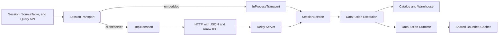
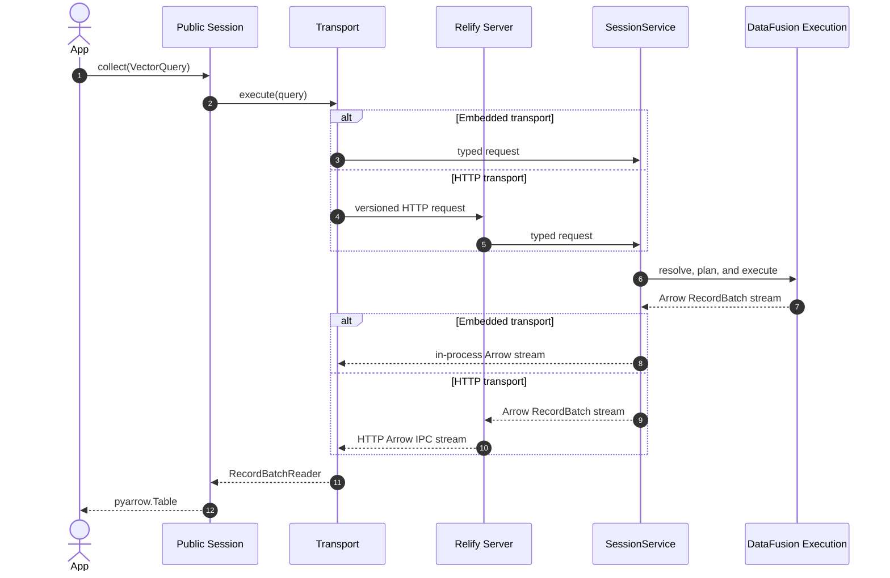

# Unified Embedded and Client/Server API

## Problem

Relify currently exposes its embedded DataFusion implementation directly:
`Session` inherits `SessionContext`, and `SourceTable` inherits DataFusion's
`DataFrame`. This is convenient locally, but it makes a client/server mode
impossible to add without either introducing a second public API or pretending
that process-local DataFusion objects can cross a network boundary.

Client/server execution is needed for concurrent serving. One server process can
own the execution runtime, catalog connections, and bounded caches while many
clients submit queries. A multiprocessing benchmark or application should not
create one independent Relify runtime and Page cache per worker.

The public API must not expose this deployment choice. After `connect`, source
registration, index lifecycle, query construction, execution, result schemas,
and errors must have the same behavior in embedded and client/server modes.

LanceDB provides the relevant API and protocol precedent. One `connect` entry
point selects a local or remote connection, while both implementations satisfy
the same connection, table, and query interfaces. Its REST Catalog also defines
operation models once and maps them to versioned HTTP routes with JSON metadata
and Arrow IPC data. Relify adopts both principles. It does not retain a public
compute-backend plugin layer: embedded and client/server requests both execute
through the same DataFusion engine.

References:

- [LanceDB `connect`](https://github.com/lancedb/lancedb/blob/main/python/python/lancedb/__init__.py)
- [LanceDB connection interface](https://github.com/lancedb/lancedb/blob/main/python/python/lancedb/db.py)
- [LanceDB table interface](https://github.com/lancedb/lancedb/blob/main/python/python/lancedb/table.py)
- [Lance REST Catalog](https://lance.org/format/catalog/rest/)
- [Lance Namespace OpenAPI specification](https://github.com/lance-format/lance-namespace/blob/main/docs/src/spec.yaml)

## Decisions

| Question | Decision |
| --- | --- |
| How does an application select the mode? | `relify.connect` selects embedded or client/server execution from the URI. |
| Does the mode change user operations? | No. Both modes return the same public `Session`, `SourceTable`, and query types. |
| Is compute execution a public plugin point? | No. The supported engine is DataFusion. External engines may use the open specification or a reference SQL compiler. |
| Where is query meaning defined? | A transport-neutral `VectorQuery` or SQL string describes the request. |
| Where is a request executed? | Both transports invoke the same session-service contract backed by DataFusion. |
| What is the remote protocol? | A versioned HTTP/HTTPS API described by OpenAPI. It follows the Lance REST Catalog operation and route model. |
| How are results transferred? | Metadata uses JSON. Query results use Arrow IPC streams over HTTP and are never converted to JSON by the SDK. |
| Is the DataFusion Python API part of the shared contract? | No. Engine-native objects are an explicit embedded-only escape hatch. |
| Is a catalog object exposed to applications? | No. `Session` provides table registration and discovery; index lifecycle remains table-centered. |
| What does a path mean in client/server mode? | The execution process resolves it. A server must be able to access every registered URI. |
| Who owns runtime resources? | Embedded applications own them in process; in client/server mode the server owns them and shares bounded caches across requests. |
| Does client/server execution require session affinity? | No. Every request carries its query-affecting state. Server runtime state is shared but disposable. |
| Is the first server horizontally stateless? | No. The first deployment is single-instance because it uses SQLite and process-local build coordination. The protocol does not preserve that limitation. |
| How is parity enforced? | One conformance suite runs the same operations against both transports. |

## API Contract

Only connection construction changes between modes:

```python
import relify

embedded = relify.connect("./relify-data")
remote = relify.connect("https://relify.example.com")
```

All ordinary operations are identical after connection:

```python
session = remote  # The same code also accepts `embedded`.

session.register_parquet(
    "documents",
    "s3://lakehouse/documents/*.parquet",
)

documents = session.table("documents")
documents.create_index(
    "document_embedding",
    column="embedding",
    key=["id"],
    config=relify.IVF(nlist=4096, encoding="lvq8", metric="cosine"),
)
documents.wait_for_index("document_embedding")

query = (
    documents.search(vector, column="embedding")
    .where("tenant_id = 42")
    .nprobes(64)
    .limit(10)
    .select(["id", "text"])
)

hits = session.collect(query)
```

### Public object model

The portable API contains five user-facing areas. Catalog storage, transport,
and server administration are not additional application objects.

#### Connection

| API | Result |
| --- | --- |
| `relify.connect(location, ...)` | One public `Session` facade backed by an in-process or HTTP transport. |
| `session.close()` | Release client or embedded resources. |
| `with relify.connect(...) as session` | Close the session when the context exits. |

Connection credentials, deadlines, and deployment configuration may differ by
URI. They do not change the methods available after connection.

#### Table registration and discovery

| API | Result |
| --- | --- |
| `session.register_parquet(name, uri, ...)` | Persist one Parquet source definition. |
| `session.deregister_table(name)` | Remove one persisted source definition. |
| `session.list_tables()` | Return registered table identifiers. |
| `session.table(identifier)` | Return a `SourceTable`. |

Relify does not expose `session.catalog`, `session.catalogs`, or a storage-level
catalog object. A session is already bound to one database catalog and acts as
the table-discovery facade. Qualified identifiers may represent namespaces
when the configured catalog supports them.

Catalog implementations and index metadata lookup remain internal service
interfaces. The existing `open_index_catalog` entry point is removed from the
ordinary public API instead of being proxied through the client/server
transport.

Not exposing a catalog object does not remove the catalog boundary. The first
implementation keeps SQLite as the embedded authority for source definitions,
index metadata pointers, build state, and reusable artifact records. A future
server may replace it with a transactional shared implementation without
changing `Session` or `SourceTable`.

#### Table and index lifecycle

| API | Result |
| --- | --- |
| `table.identifier` | Stable table identifier. |
| `table.schema` | Portable Arrow schema. |
| `table.create_index(...)` | Submit an index build. |
| `table.index_status(index)` | Return the current `IndexStatus`. |
| `table.wait_for_index(index, ...)` | Wait for a terminal build state. |
| `table.list_indexes()` | Return portable `IndexInfo` values. |
| `table.refresh_index(index, ...)` | Rebuild and atomically replace an index. |
| `table.drop_index(index)` | Remove an index publication. |
| `table.search(vector, ...)` | Construct a `VectorQuery`. |

Index metadata publication remains an internal catalog responsibility. Users
address indexes through their source table rather than manipulating catalog
records or metadata locations.

#### Query construction

`VectorQuery` remains an immutable, transport-independent value and supports the
same builder operations in both modes:

| API | Meaning |
| --- | --- |
| `select(columns)` | Project result columns. |
| `where(predicate)` | Add a SQL predicate. |
| `nprobes(count)` | Select the IVF probe count. |
| `limit(count)` | Select the result count. |
| `bypass_vector_index()` | Execute the reference path without an index. |

SQL does not require a public query wrapper. A statement is passed directly as
a string; the transport converts it into an internal request without exposing
that request type to applications. A `VectorQuery` contains no DataFusion plan,
network channel, or session reference.

```python
vector_query = documents.search(vector, column="embedding").limit(10)
sql = "SELECT category, COUNT(*) FROM documents GROUP BY category"

vector_hits = session.collect(vector_query)
category_counts = session.collect(sql)
```

The portable SQL surface initially accepts read-only query statements,
including projections, filters, joins, CTEs, aggregations, ordering, and
limits. DataFusion `SET`, DDL, temporary objects, and process-local UDF
registration are not portable SQL operations. `session.sql(statement)` executes
and collects the statement. Callers pass the same string to `stream`, `explain`,
or `analyze` when they need a different terminal operation.

#### Execution and results

| API | Result |
| --- | --- |
| `session.stream(query)` | `pyarrow.RecordBatchReader` |
| `session.collect(query)` | `pyarrow.Table` |
| `session.sql(statement)` | Convenience alias for `session.collect(statement)`. |
| `session.to_arrow(query)` | Compatibility alias for `collect`. |
| `session.explain(query, ...)` | Portable plan description. |
| `session.analyze(query)` | Executed plan and runtime metrics. |

The execution methods accept either `VectorQuery` or a SQL string. Empty results
retain the same schema in both modes. Streaming prevents a remote client from
materializing a large result before consuming it.

### Reference SQL compiler

Support for an external SQL engine does not require a Relify Session, plugin,
capability matrix, or execution adapter. A separate reference compiler may
consume a `VectorQuery`, published index metadata, a SQL dialect, and explicit
relation bindings, and return generated SQL plus its result schema and required
relations.

The compiler does not connect to an engine, register tables, resolve engine
catalogs, execute queries, inspect engine versions, or promise a performance
profile. Its first useful scope is the UDF-free Level 0 query for a
source-encoded IVF index. Encodings that require an efficient native distance
kernel, including LVQ4 and LVQ8, are not forced through generic SQL.

### DataFusion escape hatch

The common `Session` must no longer inherit DataFusion `SessionContext`, and
`SourceTable` must no longer inherit DataFusion `DataFrame`. Arbitrary
DataFusion plans, Python callbacks, UDF objects, and process-local providers
cannot be serialized with stable semantics.

The embedded package may retain an explicit API for obtaining its underlying
DataFusion context. That API is outside the portable Relify contract, is not
available on a client/server connection, and must not be used by Relify's own
table, index, or query implementations. The normal SQL surface remains
portable and executes through the session service.

### URI and path semantics

An `http://` or `https://` URL identifies a Relify server. A filesystem path or
existing local catalog form selects embedded execution. Connection credentials
and timeouts are transport options; they do not alter table or query behavior.

Paths passed to operations are resolved by the process that executes the
operation:

- embedded mode resolves local paths in the application process;
- client/server mode resolves local paths in the server process; and
- object-store URIs are read by the execution process using its credentials.

`register_parquet` does not upload a client's local files. Applications that
need one source in both modes should use a shared URI or mount the same path in
the server environment.

### HTTP protocol

Relify follows the Lance REST Catalog's operation-oriented protocol design
rather than translating the API into generic CRUD resources. Every public
operation has one transport-neutral request and response model. The embedded
transport calls that operation directly; the HTTP transport serializes the same
model as JSON or Arrow IPC.

Routes include the table identifier whenever an operation is table-scoped. This
lets a reverse proxy perform routing, authentication, authorization, and
request accounting without deserializing the body. The first protocol version
uses these routes:

| Operation | Route | Response |
| --- | --- | --- |
| List tables | `GET /v1/table` | JSON |
| Register a Parquet source | `POST /v1/table/{id}/register` | JSON |
| Describe a table | `POST /v1/table/{id}/describe` | JSON |
| Deregister a source | `POST /v1/table/{id}/deregister` | JSON |
| Query a table | `POST /v1/table/{id}/query` | Arrow IPC stream |
| Execute SQL | `POST /v1/sql` | Arrow IPC stream |
| Create an index | `POST /v1/table/{id}/create_index` | JSON |
| List indexes | `POST /v1/table/{id}/index/list` | JSON |
| Read index status | `POST /v1/table/{id}/index/{index_name}/stats` | JSON |
| Refresh an index | `POST /v1/table/{id}/index/{index_name}/refresh` | JSON |
| Drop an index | `POST /v1/table/{id}/index/{index_name}/drop` | JSON |

`POST /v1/table/{id}/query` accepts the JSON representation of `VectorQuery`.
`POST /v1/sql` accepts a SQL statement because a join or CTE may not have one
table that can be named in the route. Both return
`application/vnd.apache.arrow.stream`. Index construction remains asynchronous;
the create or refresh response acknowledges the build, and clients poll the
index stats operation when implementing `wait_for_index`.

The HTTP API is specified with OpenAPI 3.1. Authentication uses standard HTTP
headers, and a request identifier is returned in a response header. API version
compatibility is explicit in the `/v1` path rather than negotiated by a
connection-specific handshake.

## Architecture

The process boundary is below the public API and above one concrete execution
engine:



`SessionTransport` is a private client-side boundary. It translates public
values into service requests and portable results. It contains no index
planning or DataFusion logic.

`SessionService` owns the operation contract. Its in-process implementation is
called directly by `InProcessTransport`; the server exposes the same contract
through `HttpTransport`. Validation, index selection, planning, and error
classification happen behind this boundary once, rather than being duplicated
in a remote client.

### Server state and horizontal scaling

One server process owns a database runtime containing:

- the catalog and warehouse configuration;
- the DataFusion worker pool and memory pool;
- the decompressed Parquet Page cache;
- immutable metadata, manifest, and centroid caches; and
- index build coordination.

The first server deployment has two classes of state:

| State | Examples | Authority |
| --- | --- | --- |
| Durable | Source registrations, index metadata locations, centroid artifacts, and build state. | Catalog and published storage. |
| Disposable | DataFusion runtime, active queries, Page cache, and metadata, manifest, and centroid caches. | One server process. |

Correctness must not depend on disposable state. Restarting the server may make
the next query cold, but the server reconstructs published tables and indexes
from the catalog and storage.

The client-side `Session` is a connection facade, not a promise of mutable
server-side session state. Every request carries all query-affecting options.
The portable API does not include SQL variables, temporary tables, or
connection-local UDFs, so requests do not require routing back to one server.
Persistent source registration and index lifecycle operations update the
durable catalog explicitly.

The server, rather than an untrusted client, controls process-wide settings
such as worker count, memory-pool size, cache capacity, storage credentials,
and bind address. Portable query settings are encoded in each request or in
client defaults expanded before transport. The configuration API must
distinguish these from deployment settings instead of forwarding arbitrary
local DataFusion settings from a remote client.

The first implementation is single-instance because SQLite and the current
build coordinator are not shared coordination services. A future stateless
deployment replaces them with a transactional shared catalog and durable build
claims while keeping source and index data in shared storage. Multiple server
replicas may then keep independent disposable caches behind a load balancer;
the Python API and request protocol do not change.

## Request Execution



The remote wire contract is the OpenAPI operation model described above. JSON
requests carry SQL, vector-query options, source definitions, and index
lifecycle commands. Query endpoints stream Arrow RecordBatches as Arrow IPC;
metadata and status operations return JSON. The HTTP adapter contains no query
planning or catalog logic.

## Errors and Cancellation

Both transports map failures to the same public Relify exception hierarchy.
HTTP errors use the status code plus a JSON body containing a stable Relify error
code, a safe message, and the request identifier. Python client code must not
need to catch HTTP-library exceptions for ordinary Relify failures.

Client deadlines and cancellation propagate to query execution. Disconnecting
a client releases its result stream and query state, but does not implicitly
cancel an index build that has already been accepted. Build status remains
observable through the index lifecycle API.

Transport failures such as an unreachable server are exposed as a dedicated
Relify availability error with the original transport error as its cause.

## Conformance

The portable API is the intersection implemented with identical semantics in
both modes, not the union of convenient local and remote methods. A public
portable method must not silently become a no-op or return a different object
type in one mode.

One parameterized conformance suite starts:

1. an embedded session over a temporary database;
2. a Relify server over an equivalent temporary database; and
3. a client/server session connected to that server.

It runs the same source registration, index lifecycle, vector query, SQL,
filter, projection, empty-result, explain, cancellation, and failure cases. It
compares Arrow schemas, ordered vector results, index states, and public
exception types. Tests may inspect plans separately because physical plan text
can contain deployment-specific details.

The client/server suite also restarts the server after registration and index
publication. The same table and index must remain queryable without preserving
the previous process caches or a server-side session token.

The public Python types returned by `connect`, `table`, `search`, and `sql` are
the same in both modes. Transport implementations remain private.

## Migration

The public facade is extracted before networking is added:

1. replace inheritance from DataFusion classes with `Session` and
   `SourceTable` facades;
2. remove the backend registry, plugin API, capability matrix, and bundled
   Spark and StarRocks sessions;
3. move current DataFusion behavior behind `SessionService` and
   `InProcessTransport`;
4. make `VectorQuery` and SQL strings the only inputs to portable terminals;
5. run the existing local suite through the facade; and
6. add `HttpTransport` and the server without changing application code.

This is a deliberate pre-1.0 API correction. Compatibility aliases may be
kept for `collect` and `to_arrow`, but DataFusion object inheritance must not be
preserved because it would make the shared contract false.

The initial client/server milestone may open an existing catalog and execute
queries before remote index construction is enabled. It is conformant only for
the methods it implements and remains explicitly unstable; client/server mode
is not declared stable until the complete portable surface passes the same
conformance suite.

## Alternatives

### Separate `RelifyClient`

Rejected. It immediately creates two application APIs and makes every example,
integration, and benchmark mode-aware.

### Compute backend plugin framework

Rejected. There is no second supported execution engine that justifies a
versioned plugin API, capability matrix, native session types, and shared
planner contract. Open index specifications and a narrow SQL compiler provide
an integration boundary without making Relify own each engine's connection,
catalog, execution, and compatibility lifecycle.

### Proxy DataFusion `DataFrame` objects

Rejected. DataFusion plans can contain process-local providers, expressions,
UDFs, and Python objects. A partial proxy would look compatible while failing
on valid local operations.

### Arrow Flight

Rejected as the required client/server protocol. Flight would require a
Flight-capable SDK and does not provide a browser-native client path. HTTP can
carry the same Arrow IPC RecordBatch stream while JSON remains limited to
operation metadata. Flight may be reconsidered as an optional adapter only when
a concrete interoperability or performance requirement justifies a second
wire protocol.

### JSON query results

Rejected as the portable SDK result format. JSON loses Arrow type fidelity and
adds row conversion and copying. Browser clients can consume Arrow IPC streams
with Apache Arrow JavaScript.

### One embedded runtime per benchmark worker

Rejected as the concurrent-serving design. It duplicates catalogs, execution
runtimes, metadata, and Page caches, and measures client process construction
instead of one serving system under concurrent load.

## Out of Scope

This RFC does not define:

- distributed or multi-node query execution;
- high availability or server failover;
- multi-tenant database isolation;
- client-side local-file upload;
- mutable server-side SQL session state;
- arbitrary Python UDF transfer;
- a remote proxy for the complete DataFusion Python API;
- Arrow Flight or Flight SQL;
- hosting Spark or StarRocks inside the first server; or
- the final authentication, authorization, and TLS deployment model.

The first server binds to loopback by default. Listening on a non-loopback
address must require an explicit deployment choice until authentication and TLS
are specified.
